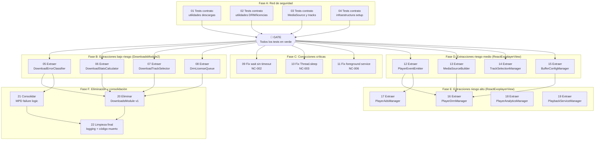

# Plan de Refactorización: Android Native Module

> Generado a partir de la auditoría del 17/02/2026
> Código fuente: `android/src/main/java/com/brentvatne/`

## Resumen ejecutivo

- **Módulo auditado**: `android/src/main/java/com/brentvatne/` (~44 ficheros, ~11.000 líneas Java/Kotlin)
- **Tareas totales**: 22 (4 de testing + 18 de refactorización)
- **Estimación total**: 40-60 horas
- **Riesgo general**: Medio

## Principios de la refactorización

1. **Tests primero**: no se toca código de producción sin tests de contrato en verde
2. **Incremental**: cada tarea produce código funcional y deployable
3. **Verificable**: cada tarea tiene criterios de aceptación medibles
4. **Reversible**: cada tarea puede revertirse sin afectar las anteriores

---

## Mapa de tareas

### Diagrama de dependencias

### Tabla resumen

| # | Tarea | Tipo | Riesgo | Estimación | Depende de | IDs Auditoría | Tests de contrato que la validan |
|---|-------|------|--------|------------|------------|---------------|----------------------------------|
| 01 | Tests contrato utilidades descargas | test-contrato | bajo | 2-3h | — | REQ-022, REQ-028, REQ-032 | — (es ella misma) |
| 02 | Tests contrato utilidades DRM/licencias | test-contrato | bajo | 2-3h | — | REQ-015, REQ-016, REQ-017, REQ-019 | — (es ella misma) |
| 03 | Tests contrato MediaSource y tracks | test-contrato | bajo | 1-2h | — | REQ-002, REQ-004 | — (es ella misma) |
| 04 | Setup infraestructura de tests | test-contrato | bajo | 1-2h | — | — | — (es ella misma) |
| 05 | Extraer DownloadErrorClassifier | extracción | bajo | 1-2h | 01, 04 | REQ-032, CI-002 | DownloadErrorClassifierTest |
| 06 | Extraer DownloadStatsCalculator | extracción | bajo | 1-2h | 01, 04 | REQ-028 | DownloadStatsCalculatorTest |
| 07 | Extraer DownloadTrackSelector | extracción | bajo | 1-2h | 01, 04 | REQ-022 | DownloadTrackSelectorTest |
| 08 | Extraer DrmLicenseQueue | extracción | bajo-medio | 1-2h | 02, 04 | REQ-019 | DrmLicenseQueueTest |
| 09 | Fix wait() sin timeout | corrección | medio | 0.5-1h | 04 | NC-002 | — (no hay test de contrato directo) |
| 10 | Fix Thread.sleep() en main thread | corrección | medio | 0.5-1h | 04 | NC-003 | — (no hay test de contrato directo) |
| 11 | Fix foreground service silencioso | corrección | medio | 1-2h | 04 | NC-006 | — (no hay test de contrato directo) |
| 12 | Extraer PlayerEventEmitter | extracción | medio | 2-3h | 04 | REQ-007 | — (tests de integración post-extracción) |
| 13 | Extraer MediaSourceBuilder | extracción | medio | 1-2h | 03, 04 | REQ-002, REQ-006 | MediaSourceBuilderTest |
| 14 | Extraer TrackSelectionManager | extracción | medio | 2-3h | 03, 04 | REQ-004, REQ-011 | — (tests de integración post-extracción) |
| 15 | Extraer BufferConfigManager | extracción | medio | 1-2h | 04 | REQ-003, CI-006 | — (tests unitarios post-extracción) |
| 16 | Extraer PlayerDrmManager | extracción | medio-alto | 2-3h | 12, 13, 15 | REQ-012, REQ-013, REQ-014 | — (tests de integración post-extracción) |
| 17 | Extraer PlayerAdsManager | extracción | medio | 1-2h | 12 | REQ-033 | — (tests de integración post-extracción) |
| 18 | Extraer PlayerAnalyticsManager | extracción | medio | 1-2h | 04 | REQ-034 | — (tests unitarios post-extracción) |
| 19 | Extraer PlaybackServiceManager | extracción | medio | 1-2h | 04 | REQ-010 | — (tests unitarios post-extracción) |
| 20 | Eliminar DownloadsModule v1 | eliminación | medio-alto | 1-2h | 05, 06, 07, 08 | CI-001, CI-003, NC-001, NC-013 | DownloadErrorClassifierTest, DownloadStatsCalculatorTest, DownloadTrackSelectorTest, DrmLicenseQueueTest |
| 21 | Consolidar lógica MPD failure | simplificación | medio | 1-2h | 05 | CI-002 | DownloadErrorClassifierTest |
| 22 | Limpieza final: logging + código muerto | limpieza | bajo | 2-3h | 20, 21 | CI-004, CI-007, CI-008, CI-009 | Todos los tests de contrato |

---

## Fases de ejecución

### ⚠️ Fase A: Red de seguridad (BLOQUEANTE)

**Objetivo**: Capturar el comportamiento actual del código con tests de contrato antes de tocar nada. Configurar la infraestructura de tests que no existe actualmente.

**Tareas**: 01, 02, 03, 04

**Fuente de los tests**: El fichero `03-estrategia-testing.md` de la auditoría contiene código de test concreto para estas tareas. Cada task.md de esta fase referencia la sección correspondiente.

**Criterio de fase completada**:
- Todos los tests de contrato ejecutan y pasan en verde
- El comando `./gradlew :react-native-video:test` sale con código 0
- Se ha validado que los tests cubren todos los REQ-XXX de criticidad alta y crítica que son testeables unitariamente

**🚧 GATE**: No proceder a la Fase B hasta que TODOS los tests de contrato estén en verde. Sin excepciones.

**Qué hacer si un test de contrato no pasa contra el código actual**:
- Si el test está mal escrito: corregir el test (el código actual es la verdad).
- Si el código tiene un bug real: documentarlo como NC-XXX en la auditoría y decidir si corregirlo ahora (nueva tarea) o aceptarlo como comportamiento actual.

---

### Fase B: Extracciones de bajo riesgo (DownloadsModule2)

**Objetivo**: Extraer las 4 utilidades puras/semi-puras de `DownloadsModule2.java`, reduciendo su tamaño en ~520 líneas y creando unidades testeables independientes.

**Tareas**: 05, 06, 07, 08

**Pre-requisito**: Fase A completada (GATE superado)

**Criterio de fase completada**:
- Las 4 nuevas clases existen con tests propios
- `DownloadsModule2.java` ha pasado de 2446 a ~1900 líneas
- Los tests de contrato de Fase A siguen en verde
- El build compila sin errores

**Validación de regresión**: Al completar cada tarea de esta fase, ejecutar `./gradlew :react-native-video:test`. Deben seguir en verde.

---

### Fase C: Correcciones de casos no contemplados críticos

**Objetivo**: Corregir los 3 problemas más peligrosos identificados en la auditoría antes de reestructurar el código.

**Tareas**: 09, 10, 11

**Pre-requisito**: Fase A completada (GATE superado). Puede ejecutarse en paralelo con Fase B.

**Criterio de fase completada**:
- NC-002 (wait sin timeout): `initializePlayerSource()` tiene timeout de 10 segundos
- NC-003 (Thread.sleep): `reinitializeDownloadManager()` no bloquea el main thread
- NC-006 (foreground service): se emite evento a JS cuando el servicio no puede iniciarse
- Los tests de contrato de Fase A siguen en verde

---

### Fase D: Extracciones de riesgo medio (ReactExoplayerView)

**Objetivo**: Extraer 4 unidades del God Object `ReactExoplayerView.java`, reduciendo su tamaño en ~650 líneas.

**Tareas**: 12, 13, 14, 15

**Pre-requisito**: Fase A completada (GATE superado). Puede ejecutarse en paralelo con Fases B y C.

**Criterio de fase completada**:
- Las 4 nuevas clases existen con tests propios
- `ReactExoplayerView.java` ha pasado de 2885 a ~2200 líneas
- Los tests de contrato de Fase A siguen en verde

**Validación de regresión**: Al completar cada tarea, ejecutar `./gradlew :react-native-video:test`.

---

### Fase E: Extracciones de riesgo alto (ReactExoplayerView)

**Objetivo**: Extraer los 4 managers restantes del God Object, dejándolo como orquestador puro de ~800-1000 líneas.

**Tareas**: 16, 17, 18, 19

**Pre-requisito**: Tarea 12 (PlayerEventEmitter) completada para tareas 16 y 17. Tarea 13 (MediaSourceBuilder) y 15 (BufferConfigManager) completadas para tarea 16.

**Criterio de fase completada**:
- `ReactExoplayerView.java` reducido a ~800-1000 líneas
- 8 managers/utilidades extraídos con tests propios
- Los tests de contrato de Fase A siguen en verde

---

### Fase F: Eliminación y consolidación

**Objetivo**: Eliminar código duplicado y complejidad innecesaria.

**Tareas**: 20, 21, 22

**Pre-requisito**: Fase B completada para tarea 20. Tarea 05 completada para tarea 21. Tareas 20 y 21 completadas para tarea 22.

**Criterio de fase completada**:
- `DownloadsModule.java` eliminado (-1149 líneas)
- Lógica de high-progress MPD unificada en un solo punto
- Logging condicionado a `BuildConfig.DEBUG`
- Código muerto eliminado
- Los tests de contrato de Fase A siguen en verde (o tienen cambios documentados)

---

## Orden de ejecución recomendado

Para cada tarea de **Fase A** (tests de contrato):

1. Navega a la carpeta de la tarea
2. Ejecuta `/spec` para detallar qué tests se escriben (basándose en `03-estrategia-testing.md`)
3. Ejecuta `/plan` para planificar la implementación de los tests
4. Ejecuta `/implement` para escribir los tests
5. Ejecuta `/review` para verificar cobertura y que pasan en verde
6. **No ejecutes `/verify`** — no hay baseline de tests que verificar, se están creando

Para cada tarea de **Fase B en adelante** (refactorización):

1. Navega a la carpeta de la tarea
2. Ejecuta `/spec` para generar la especificación técnica
3. Ejecuta `/verify` para validar las asunciones contra el código actual
4. Ejecuta `/plan` para generar el plan de implementación detallado
5. Ejecuta `/implement` para implementar fase por fase
6. **Valida que los tests de contrato siguen en verde** antes de commitear
7. Ejecuta `/review` para validar la implementación

---

## Gestión de riesgos

### Puntos de no retorno

- **Después de la tarea 20** (eliminar DownloadsModule v1): Si código JS referencia `NativeModules.Downloads`, dejará de funcionar. Validar ANTES de ejecutar.
- **Después de la tarea 16** (PlayerDrmManager): La gestión de DRM es crítica. Si falla, el contenido protegido no se reproduce. Validar exhaustivamente con contenido Widevine online y offline.

### Si los tests de contrato fallan durante una refactorización

1. **No commitear**
2. Identificar qué test falla y qué tarea lo causó
3. Opciones:
   - Corregir el código refactorizado para mantener el contrato
   - Si el cambio de contrato es intencional: documentarlo en el task.md como "Cambio de contrato" y actualizar el test con justificación
   - Revertir la tarea si no se encuentra la causa

### Plan de contingencia

- Si la tarea 16 (PlayerDrmManager) falla: revertir y mantener DRM inline en ReactExoplayerView. El resto de extracciones no dependen de ella.
- Si la tarea 20 (eliminar DownloadsModule v1) falla: revertir. Las extracciones de Fase B siguen siendo válidas con ambos módulos presentes.
- Si se descubre un problema no previsto: crear nueva tarea con prefijo "XX-hotfix-" y ejecutar el ciclo completo.

### Supuestos a validar

1. **¿Se usa `NativeModules.Downloads` (sin "2") en código JS/TS?** — Crítico para tarea 20. Buscar antes de ejecutar.
2. **¿Los callbacks de `IOfflineLicenseManagerListener` en `ReactExoplayerView.java` están implementados?** — La auditoría lo marca como pendiente de confirmar. Verificar en `/verify` de la tarea 16.
3. **¿Los thresholds de high-progress MPD son intencionalmente diferentes en los 3 puntos?** — Verificar en `/verify` de la tarea 21.
4. **¿El comentario "DML: No usamos token en Primeran" indica lógica deshabilitada intencionalmente?** — Verificar en `/verify` de la tarea 22.

---

## Métricas de éxito

Al completar todas las tareas:

### Testing
- [ ] Todos los tests de contrato originales siguen pasando (o tienen cambios documentados y justificados)
- [ ] Cada nueva unidad extraída tiene tests propios
- [ ] Cobertura de tests cubre todos los REQ-XXX de criticidad alta y crítica testeables unitariamente
- [ ] Comando `./gradlew :react-native-video:test` sale en verde

### Código
- [ ] Ningún fichero supera 1500 líneas (objetivo: ReactExoplayerView ~800-1000, DownloadsModule2 ~1900)
- [ ] No hay dependencias circulares entre las nuevas unidades
- [ ] Los code smells SA-01 a SA-15 están resueltos o documentados como limitaciones
- [ ] Los casos no contemplados NC-002, NC-003, NC-006 (prioridad crítica/alta) están corregidos
- [ ] La complejidad innecesaria CI-001, CI-002 (prioridad alta) está eliminada
- [ ] 0 líneas de código duplicado entre DownloadsModule y DownloadsModule2 (v1 eliminado)
- [ ] 12 nuevas unidades con responsabilidad única
