# Fase 2: Propuesta de Segmentación — Android Native Module

Basado en las conclusiones de la Fase 1 (`01-analisis-estructural.md`).

---

## 2.1 Arquitectura propuesta

### Ficheros que requieren segmentación

Los ficheros candidatos a segmentación son aquellos identificados en la Fase 1 con múltiples responsabilidades (SA-01, SA-02) y acoplamiento fuerte interno (sección 1.2):

1. **`ReactExoplayerView.java`** (2885 líneas) — God Object, prioridad máxima
2. **`DownloadsModule2.java`** (2446 líneas) — Múltiples responsabilidades
3. **`DownloadsModule.java`** (1149 líneas) — Duplicado de DownloadsModule2, candidato a eliminación
4. **`AxDownloadTracker.java`** (427 líneas) — Lógica de high-progress duplicada y compleja

### Ficheros que NO requieren segmentación

| Fichero | Justificación |
|---------|---------------|
| `ReactExoplayerViewManager.java` (572 lín.) | Bridge puro de props. Cada setter es independiente. La complejidad se reduce automáticamente al segmentar `ReactExoplayerView`. |
| `AxOfflineManager.java` (304 lín.) | Singleton con responsabilidad clara. Los problemas (SA-11, SA-13) se resuelven con fixes puntuales, no con segmentación. |
| `AxDownloadService.java` (338 lín.) | Servicio con responsabilidad clara. El problema de broadcast en `getForegroundNotification()` se resuelve extrayendo el broadcast, no segmentando el fichero. |
| `OfflineLicenseManager.java` (471 lín.) | Bien estructurado internamente. Los AsyncTask (SA-10) se reemplazan in-place. |
| `VideoPlaybackService.kt` (389 lín.) | Servicio con responsabilidad clara. |
| Todos los ficheros en `license/internal/` | Ya bien segmentados con responsabilidad única. |
| Ficheros auxiliares listados en Fase 1 | Ya tienen responsabilidad única. |

---

### Segmentación de ReactExoplayerView.java

Se propone descomponer el God Object en 8 unidades especializadas que el `ReactExoplayerView` orquesta.

#### Unidad 1: `PlayerDrmManager.java`

- **Ubicación**: `exoplayer/drm/PlayerDrmManager.java`
- **Responsabilidad única**: Gestión completa de DRM sessions (online y offline)
- **Tipo**: Manager
- **Interfaz pública**:
  ```java
  public class PlayerDrmManager {
      // Construcción
      PlayerDrmManager(Context context);

      // Configuración (llamados desde setters de ReactExoplayerView)
      void setDrmType(UUID drmUUID);
      void setDrmLicenseUrl(String url);
      void setDrmLicenseHeader(String[] header);
      void setPlayOffline(boolean playOffline);
      void setMultiSession(boolean multiSession);

      // Inicialización del DRM session manager
      // Retorna null si necesita defer (offline license pending)
      @Nullable DrmSessionManager buildDrmSessionManager(
          DataSource.Factory dataSourceFactory,
          String[] drmLicenseHeader,
          UUID drmUUID
      );

      // Para offline: inicialización con license keys
      @Nullable DrmSessionManager initializeOfflineDrm(
          String manifestUrl,
          IOfflineLicenseManagerListener listener
      );

      // Callback cuando la licencia offline se adquiere
      void onOfflineLicenseAcquired(byte[] keySetId);

      // Estado
      boolean hasDrmFailed();
      void resetDrmFailure();

      // Cleanup
      void release();
  }
  ```
- **Dependencias de entrada**: `Context`, `DataSource.Factory`, `OfflineLicenseManager`, `LicenseFileUtils`
- **Eventos/callbacks de salida**: `DrmSessionEventListener` (delegado), `IOfflineLicenseManagerListener` (delegado)

#### Unidad 2: `PlayerAdsManager.java`

- **Ubicación**: `exoplayer/ads/PlayerAdsManager.java`
- **Responsabilidad única**: Integración con IMA SDK para ads
- **Tipo**: Manager
- **Interfaz pública**:
  ```java
  public class PlayerAdsManager {
      PlayerAdsManager(Context context);

      void setAdTagUrl(String adTagUrl);

      // Crea el AdsLoader si hay adTag configurado
      @Nullable ImaAdsLoader createAdsLoader();

      // Wraps media source con ads si aplica
      MediaSource wrapWithAds(
          MediaSource mediaSource,
          DataSpec adTagDataSpec,
          MediaSource.Factory mediaSourceFactory
      );

      // Listeners
      void setAdEventListener(AdEvent.AdEventListener listener);
      void setAdErrorListener(AdErrorEvent.AdErrorListener listener);

      // Cleanup
      void release();
  }
  ```
- **Dependencias de entrada**: `Context`, `ImaAdsLoader`
- **Eventos/callbacks de salida**: `AdEvent.AdEventListener`, `AdErrorEvent.AdErrorListener`

#### Unidad 3: `PlayerAnalyticsManager.java`

- **Ubicación**: `exoplayer/analytics/PlayerAnalyticsManager.java`
- **Responsabilidad única**: Integración con Youbora/NPAW analytics
- **Tipo**: Manager
- **Interfaz pública**:
  ```java
  public class PlayerAnalyticsManager {
      PlayerAnalyticsManager();

      // Configuración desde props
      void setYouboraOptions(ReadableMap youboraOptions);

      // Integración con player
      void attachToPlayer(ExoPlayer player);
      void detachFromPlayer();

      // Lifecycle
      void onSourceChanged(String uri, String title);
      void stop();
      void clear();

      // Estado
      boolean isActive();

      // Cleanup
      void release();
  }
  ```
- **Dependencias de entrada**: `ExoPlayer`, `NpawPlugin`, `ExoPlayerAdapter` (Youbora SDK)
- **Eventos/callbacks de salida**: Ninguno (Youbora reporta internamente)

#### Unidad 4: `MediaSourceBuilder.java`

- **Ubicación**: `exoplayer/source/MediaSourceBuilder.java`
- **Responsabilidad única**: Construcción de MediaSource según tipo de contenido y modo (online/offline)
- **Tipo**: Utilidad (stateless builder)
- **Interfaz pública**:
  ```java
  public class MediaSourceBuilder {

      // Construye el MediaSource apropiado según URI y tipo de contenido
      static MediaSource buildMediaSource(
          Uri uri,
          String extension,
          DataSource.Factory mediaDataSourceFactory,
          DataSource.Factory localDataSourceFactory,
          @Nullable DrmSessionManager drmSessionManager,
          @Nullable DownloadRequest downloadRequest,
          boolean playOffline,
          long contentStartTime
      );

      // Construye text sources (subtítulos)
      static MediaSource[] buildTextSources(
          ReadableArray textTracks,
          DataSource.Factory mediaDataSourceFactory
      );

      // Determina tipo de contenido desde URI/extensión
      static @ContentType int inferContentType(Uri uri, String extension);
  }
  ```
- **Dependencias de entrada**: `DataSource.Factory`, `DrmSessionManager`, `DownloadRequest`
- **Eventos/callbacks de salida**: Ninguno (función pura)

#### Unidad 5: `TrackSelectionManager.java`

- **Ubicación**: `exoplayer/tracks/TrackSelectionManager.java`
- **Responsabilidad única**: Selección y gestión de tracks de audio, vídeo y texto
- **Tipo**: Manager
- **Interfaz pública**:
  ```java
  public class TrackSelectionManager {
      TrackSelectionManager(DefaultTrackSelector trackSelector);

      // Selección de track por tipo y estrategia
      void setSelectedTrack(
          int trackType,       // VIDEO, AUDIO, TEXT
          String type,         // "disabled", "language", "title", "index", "resolution", "default"
          String value,
          ExoPlayer player
      );

      // Obtención de info de tracks
      WritableArray getAudioTrackInfo(Tracks tracks);
      WritableArray getTextTrackInfo(Tracks tracks);
      WritableArray getVideoTrackInfo(ExoPlayer player);

      // Track info desde manifiesto DASH (async)
      void getVideoTrackInfoFromManifest(
          Uri uri,
          DataSource.Factory dataSourceFactory,
          long contentStartTime,
          TrackInfoCallback callback
      );

      // Verificación de soporte
      static boolean isFormatSupported(Format format);

      // Configuración
      void setMaxBitRate(int maxBitRate);
      void setIsUsingContentResolution(boolean using);
  }

  interface TrackInfoCallback {
      void onTrackInfoReady(WritableArray videoTracks);
      void onTrackInfoError(Exception e);
  }
  ```
- **Dependencias de entrada**: `DefaultTrackSelector`, `ExoPlayer`
- **Eventos/callbacks de salida**: `TrackInfoCallback`

#### Unidad 6: `PlaybackServiceManager.java`

- **Ubicación**: `exoplayer/service/PlaybackServiceManager.java`
- **Responsabilidad única**: Conexión y gestión del VideoPlaybackService para notificaciones de reproducción
- **Tipo**: Manager
- **Interfaz pública**:
  ```java
  public class PlaybackServiceManager {
      PlaybackServiceManager(Context context);

      // Conexión al servicio
      void connect(ExoPlayer player, String title, String artist, Uri artworkUri);
      void disconnect();

      // Estado
      boolean isConnected();

      // Configuración
      void setDisableNotificationControls(boolean disable);

      // Cleanup
      void release();
  }
  ```
- **Dependencias de entrada**: `Context`, `ExoPlayer`, `VideoPlaybackService`
- **Eventos/callbacks de salida**: Ninguno

#### Unidad 7: `PlayerEventEmitter.java`

- **Ubicación**: `exoplayer/events/PlayerEventEmitter.java`
- **Responsabilidad única**: Emisión de eventos del player hacia React Native
- **Tipo**: Service
- **Interfaz pública**:
  ```java
  public class PlayerEventEmitter {
      PlayerEventEmitter(ThemedReactContext context, int viewId);

      // Eventos de reproducción
      void onVideoLoadStart();
      void onVideoLoad(WritableMap videoInfo);
      void onVideoBuffer(boolean isBuffering);
      void onVideoProgress(double currentTime, double playableDuration, double seekableDuration);
      void onVideoSeek(double currentTime, double seekTime);
      void onVideoEnd();
      void onVideoError(String errorString, Exception exception, String errorCode);
      void onVideoFullscreenPlayerWillPresent();
      void onVideoFullscreenPlayerDidPresent();
      void onVideoFullscreenPlayerWillDismiss();
      void onVideoFullscreenPlayerDidDismiss();

      // Eventos de estado
      void onPlaybackStateChanged(boolean isPlaying);
      void onPlaybackRateChange(float rate);
      void onVolumeChange(float volume);
      void onAudioBecomingNoisy();
      void onTimedMetadata(Metadata metadata);
      void onTextTrackDataChanged(String subtitleText);

      // Eventos de tracks
      void onAudioTracksChanged(WritableArray audioTracks);
      void onTextTracksChanged(WritableArray textTracks);
      void onVideoTracksChanged(WritableArray videoTracks);

      // Eventos de ads
      void onAdEvent(String type);
      void onAdError(String message);

      // Eventos DRM
      void onDrmSessionError(String errorString);
  }
  ```
- **Dependencias de entrada**: `ThemedReactContext`, view ID
- **Eventos/callbacks de salida**: Eventos RN vía `RCTEventEmitter`

#### Unidad 8: `BufferConfigManager.java`

- **Ubicación**: `exoplayer/buffer/BufferConfigManager.java`
- **Responsabilidad única**: Configuración de buffering y load control
- **Tipo**: Manager
- **Interfaz pública**:
  ```java
  public class BufferConfigManager {
      BufferConfigManager();

      // Configuración desde props
      void setBufferConfig(ReadableMap config);
      void setBufferingStrategy(ReadableMap strategy);

      // Construcción del LoadControl
      LoadControl buildLoadControl();

      // Cache management
      void setupCache(Context context, int cacheSizeMB);

      // Estado
      boolean needsPlayerRestart(); // true si cambió config que requiere restart
      void clearRestartFlag();
  }
  ```
- **Dependencias de entrada**: `Context`, `ReactExoplayerSimpleCache`
- **Eventos/callbacks de salida**: Ninguno

---

### Segmentación de DownloadsModule2.java

Se propone descomponer en 4 unidades especializadas.

#### Unidad 9: `DownloadTrackSelector.java`

- **Ubicación**: `react/downloads/DownloadTrackSelector.java`
- **Responsabilidad única**: Selección de tracks para descarga según calidad
- **Tipo**: Utilidad
- **Interfaz pública**:
  ```java
  public class DownloadTrackSelector {

      // Selección por calidad
      static void selectQualityTracks(
          DownloadHelper helper,
          String quality,  // "low", "medium", "high", "auto"
          Context context
      );

      // Selección de video por bitrate
      static void selectVideoTrackByBitrate(
          DownloadHelper helper,
          MappedTrackInfo mappedTrackInfo,
          int periodIndex,
          int rendererIndex,
          int maxBitrate,
          Context context
      );

      // Selección de todos los audio tracks
      static void selectAllAudioTracks(DownloadHelper helper);

      // Selección de todos los tracks de un renderer
      static void selectAllTracksForRenderer(
          DownloadHelper helper,
          MappedTrackInfo mappedTrackInfo,
          int periodIndex,
          int rendererIndex,
          String trackTypeName
      );

      // Constantes de calidad
      static final int BITRATE_LOW = 1_500_000;
      static final int BITRATE_MEDIUM = 3_000_000;
      static final int BITRATE_HIGH = 6_000_000;
  }
  ```
- **Dependencias de entrada**: `DownloadHelper`, `Context`
- **Eventos/callbacks de salida**: Ninguno (función pura)

#### Unidad 10: `DownloadStatsCalculator.java`

- **Ubicación**: `react/downloads/DownloadStatsCalculator.java`
- **Responsabilidad única**: Cálculo de estadísticas de descarga (velocidad, tiempo restante, bytes totales)
- **Tipo**: Utilidad
- **Interfaz pública**:
  ```java
  public class DownloadStatsCalculator {
      DownloadStatsCalculator();

      // Cálculo de bytes totales precisos
      long calculateAccurateTotalBytes(Download download);
      long calculateAccurateTotalBytes(Download download, boolean enableLogging);

      // Velocidad de descarga
      double calculateDownloadSpeed(String downloadId, Download download);

      // Tiempo restante estimado
      int estimateRemainingTime(String downloadId, Download download, int progress);

      // Tracking de velocidad
      void startTracking(String downloadId);
      void stopTracking(String downloadId);
      void clearAll();
  }
  ```
- **Dependencias de entrada**: Ninguna (estado interno para tracking)
- **Eventos/callbacks de salida**: Ninguno (función pura)

#### Unidad 11: `DownloadErrorClassifier.java`

- **Ubicación**: `react/downloads/DownloadErrorClassifier.java`
- **Responsabilidad única**: Clasificación de errores de descarga
- **Tipo**: Utilidad (stateless)
- **Interfaz pública**:
  ```java
  public class DownloadErrorClassifier {

      // Clasificación de errores
      static boolean isNoSpaceLeftError(Exception exception);
      static boolean isNetworkError(Exception exception);
      static boolean isForegroundServiceError(Exception exception);

      // Mapeo de estados
      static String mapDownloadState(int state);

      // Constantes de error
      static final String ERROR_NO_SPACE = "NO_SPACE_LEFT";
      static final String ERROR_NETWORK = "NETWORK_ERROR";
      static final String ERROR_FOREGROUND_SERVICE = "FOREGROUND_SERVICE_ERROR";
      static final int ENOSPC = 28;
  }
  ```
- **Dependencias de entrada**: Ninguna
- **Eventos/callbacks de salida**: Ninguno (función pura)

#### Unidad 12: `DrmLicenseQueue.java`

- **Ubicación**: `react/downloads/DrmLicenseQueue.java`
- **Responsabilidad única**: Cola serializada de descargas de licencias DRM para evitar race conditions
- **Tipo**: Manager
- **Interfaz pública**:
  ```java
  public class DrmLicenseQueue {
      DrmLicenseQueue(OfflineLicenseManager licenseManager);

      // Encolar descarga de licencia
      void enqueue(MediaItem mediaItem, Map<String, String> drmMessages);

      // Notificar que la descarga actual terminó
      void onCurrentDownloadComplete();

      // Estado
      int getPendingCount();
      boolean isProcessing();

      // Cleanup
      void clear();
  }
  ```
- **Dependencias de entrada**: `OfflineLicenseManager`, `Utility`
- **Eventos/callbacks de salida**: Llama a `OfflineLicenseManager.downloadLicenseWithResult()`

---

### Eliminación de DownloadsModule.java (v1)

**Propuesta**: Eliminar `DownloadsModule.java` completamente y mantener solo `DownloadsModule2.java` como módulo de descargas.

**Justificación**:
- SA-05 documenta 11 funcionalidades duplicadas entre ambos módulos
- `DownloadsModule2` es estrictamente un superset de `DownloadsModule` con mejoras:
  - Track selection por calidad (vs. solo max bitrate)
  - Speed tracking y estimación de tiempo restante
  - Helper cleanup con timeout
  - Cola de licencias DRM
  - Detección de errores de espacio en disco
  - Gestión de directorios configurable
- Ambos están registrados en `ReactVideoPackage.java`, lo que obliga a mantener fixes en ambos

**Prerequisito**: Confirmar con el equipo que ningún código JS referencia `DownloadsModule` (nombre del módulo RN: `"Downloads"`). Si lo hace, migrar las llamadas a `DownloadsModule2` (nombre: `"Downloads2"`).

---

## 2.2 Diagrama de dependencias

```mermaid
graph TD
    subgraph "React Native Bridge"
        RVM[ReactExoplayerViewManager]
        DM2[DownloadsModule2]
        VMM[VideoManagerModule]
        VDP[VideoDecoderPropertiesModule]
    end

    subgraph "ReactExoplayerView - Orquestador"
        REV[ReactExoplayerView<br/>~800 líneas residuales]
    end

    subgraph "Player Managers"
        PDM[PlayerDrmManager]
        PAM[PlayerAdsManager]
        PAN[PlayerAnalyticsManager]
        PSM[PlaybackServiceManager]
        BCM[BufferConfigManager]
    end

    subgraph "Player Utilities"
        MSB[MediaSourceBuilder]
        TSM[TrackSelectionManager]
        PEE[PlayerEventEmitter]
    end

    subgraph "Download Utilities"
        DTS[DownloadTrackSelector]
        DSC[DownloadStatsCalculator]
        DEC[DownloadErrorClassifier]
        DLQ[DrmLicenseQueue]
    end

    subgraph "Offline Infrastructure (sin cambios)"
        AOM[AxOfflineManager]
        ADT[AxDownloadTracker]
        ADS[AxDownloadService]
        OLM[OfflineLicenseManager]
    end

    subgraph "Rendering (sin cambios)"
        EPV[ExoPlayerView]
        FSP[FullScreenPlayerView]
    end

    %% Bridge → Orquestador
    RVM --> REV
    VMM --> REV

    %% Orquestador → Managers
    REV --> PDM
    REV --> PAM
    REV --> PAN
    REV --> PSM
    REV --> BCM

    %% Orquestador → Utilities
    REV --> MSB
    REV --> TSM
    REV --> PEE

    %% Orquestador → Rendering
    REV --> EPV
    REV --> FSP

    %% Managers → Infrastructure
    PDM --> OLM
    PSM -.-> VPS[VideoPlaybackService]

    %% Utilities (sin dependencias entre sí)
    MSB -.-> AOM
    TSM -.-> |"solo para manifest parsing"| MSB

    %% Downloads Module → Download Utilities
    DM2 --> DTS
    DM2 --> DSC
    DM2 --> DEC
    DM2 --> DLQ

    %% Downloads Module → Infrastructure
    DM2 --> AOM
    DM2 --> ADT
    DM2 --> ADS
    DLQ --> OLM

    %% Flujo unidireccional verificado
    %% No hay ciclos: Bridge → Orquestador → Managers/Utilities → Infrastructure
```



### Verificación del diagrama

- **Sin dependencias circulares**: El flujo es estrictamente Bridge → Orquestador → Managers/Utilities → Infrastructure.
- **Flujo unidireccional**: Los managers no referencian al orquestador. Comunican vía callbacks/listeners.
- **Módulos puros sin efectos**: `MediaSourceBuilder`, `DownloadTrackSelector`, `DownloadStatsCalculator`, `DownloadErrorClassifier` son stateless o con estado interno mínimo. No importan módulos con efectos secundarios.
- **Tipos compartidos**: Las interfaces (`TrackInfoCallback`, `DrmSessionEventListener`, etc.) ya existen en ExoPlayer o se definen junto a su manager. No requieren ficheros separados adicionales.

---

## 2.3 Plan de migración

Ordenado de menor a mayor riesgo. Cada paso es independiente salvo donde se indica.

---

#### Paso 1: Extraer DownloadErrorClassifier

- **Riesgo**: bajo
- **Qué se extrae**: Clasificación de errores de descarga (`isNoSpaceLeftError`, `mapDownloadState`)
- **Origen**: `DownloadsModule2.java`, funciones `isNoSpaceLeftError()` (líneas ~1882-1935) y `mapDownloadState()` (líneas ~1169-1179)
- **Destino**: `react/downloads/DownloadErrorClassifier.java`
- **Interfaz**:
  ```java
  public class DownloadErrorClassifier {
      static boolean isNoSpaceLeftError(Exception exception);
      static String mapDownloadState(int state);
  }
  ```
- **Cambios en el original**: Eliminar ambos métodos de `DownloadsModule2.java`. Reemplazar llamadas por `DownloadErrorClassifier.isNoSpaceLeftError(exception)` y `DownloadErrorClassifier.mapDownloadState(state)`.
- **Validación**: Compilar. Verificar que los eventos `overonDownloadStateChanged` y `overonDownloadError` siguen emitiéndose correctamente con los mismos valores.
- **Dependencias con otros pasos**: Ninguna.

---

#### Paso 2: Extraer DownloadStatsCalculator

- **Riesgo**: bajo
- **Qué se extrae**: Cálculo de velocidad, tiempo restante y bytes totales
- **Origen**: `DownloadsModule2.java`, funciones `calculateAccurateTotalBytes()` (líneas ~1309-1383), `calculateDownloadSpeed()` (líneas ~1385-1421), `estimateRemainingTime()` (líneas ~1423-1443), y los maps de tracking `downloadStartTimes`, `lastBytesDownloaded`, `lastSpeedCheckTime` (líneas ~1294-1296)
- **Destino**: `react/downloads/DownloadStatsCalculator.java`
- **Interfaz**:
  ```java
  public class DownloadStatsCalculator {
      long calculateAccurateTotalBytes(Download download);
      double calculateDownloadSpeed(String downloadId, Download download);
      int estimateRemainingTime(String downloadId, Download download, int progress);
      void clearAll();
  }
  ```
- **Cambios en el original**: Eliminar los 3 métodos y los 3 maps de tracking. Crear instancia `private final DownloadStatsCalculator statsCalculator = new DownloadStatsCalculator()` en `DownloadsModule2`. Reemplazar llamadas. Llamar `statsCalculator.clearAll()` en `onHostDestroy()`.
- **Validación**: Compilar. Verificar que los valores de `speed`, `remainingTime` y `totalBytes` en los eventos de progreso son idénticos a los anteriores.
- **Dependencias con otros pasos**: Ninguna.

---

#### Paso 3: Extraer DownloadTrackSelector

- **Riesgo**: bajo
- **Qué se extrae**: Selección de tracks para descarga por calidad
- **Origen**: `DownloadsModule2.java`, funciones `selectQualityTracks()` (líneas ~2081-2141), `selectVideoTrackByBitrate()` (líneas ~2250-2308), `selectAllAudioTracks()` (líneas ~2193-2245), `selectAllTracksForRenderer()` (líneas ~2147-2186)
- **Destino**: `react/downloads/DownloadTrackSelector.java`
- **Interfaz**:
  ```java
  public class DownloadTrackSelector {
      static void selectQualityTracks(DownloadHelper helper, String quality, Context context);
      static void selectAllAudioTracks(DownloadHelper helper);
  }
  ```
- **Cambios en el original**: Eliminar los 4 métodos. En `onPrepared()`, reemplazar `selectQualityTracks(helper, quality)` por `DownloadTrackSelector.selectQualityTracks(helper, quality, reactContext)` y `selectAllAudioTracks(helper)` por `DownloadTrackSelector.selectAllAudioTracks(helper)`.
- **Validación**: Compilar. Iniciar una descarga con calidad "low", "medium", "high" y "auto". Verificar que los StreamKeys en el DownloadRequest son los mismos que antes.
- **Dependencias con otros pasos**: Ninguna.

---

#### Paso 4: Extraer DrmLicenseQueue

- **Riesgo**: bajo-medio
- **Qué se extrae**: Cola serializada de descargas de licencias DRM
- **Origen**: `DownloadsModule2.java`, funciones `enqueueLicenseDownload()` (líneas ~1615-1619), `processNextLicenseDownload()` (líneas ~1621-1629), `onLicenseDownloadComplete()` (líneas ~1631-1634), `downloadLicenseForItem()` (líneas ~1636-1680), campos `pendingLicenseDownloads`, `isDownloadingLicense`, `activeDrmMessages`
- **Destino**: `react/downloads/DrmLicenseQueue.java`
- **Interfaz**:
  ```java
  public class DrmLicenseQueue {
      DrmLicenseQueue(OfflineLicenseManager licenseManager);
      synchronized void enqueue(MediaItem mediaItem, Map<String, String> drmMessages);
      synchronized void onCurrentDownloadComplete();
      void clear();
  }
  ```
- **Cambios en el original**: Eliminar los 4 métodos y los 3 campos. Crear instancia en `moduleInit()`. En `addDownload()`, reemplazar `enqueueLicenseDownload(mediaItem)` por `drmLicenseQueue.enqueue(mediaItem, activeDrmMessages)`. En callbacks `onLicenseDownloaded*` y `onLicenseDownloadFailed`, llamar `drmLicenseQueue.onCurrentDownloadComplete()`.
- **Validación**: Compilar. Descargar 3 contenidos DRM en secuencia rápida. Verificar que las licencias se descargan una a una (logs `[LICENSE_QUEUE]`).
- **Dependencias con otros pasos**: Ninguna.

---

#### Paso 5: Extraer PlayerEventEmitter

- **Riesgo**: medio
- **Qué se extrae**: Toda la emisión de eventos hacia React Native
- **Origen**: `ReactExoplayerView.java`, todas las llamadas a `eventEmitter.receiveEvent()` y `VideoEventEmitter` dispersas por el fichero (~30 puntos de emisión)
- **Destino**: `exoplayer/events/PlayerEventEmitter.java`
- **Interfaz**:
  ```java
  public class PlayerEventEmitter {
      PlayerEventEmitter(ThemedReactContext context, int viewId);
      void onVideoLoadStart();
      void onVideoLoad(WritableMap videoInfo);
      void onVideoBuffer(boolean isBuffering);
      void onVideoProgress(double currentTime, double playableDuration, double seekableDuration);
      void onVideoSeek(double currentTime, double seekTime);
      void onVideoEnd();
      void onVideoError(String errorString, Exception exception, String errorCode);
      // ... (ver interfaz completa en sección 2.1)
  }
  ```
- **Cambios en el original**: Reemplazar todas las llamadas directas a `eventEmitter.receiveEvent()` por llamadas al nuevo `PlayerEventEmitter`. El `ReactExoplayerView` mantiene una referencia `private PlayerEventEmitter emitter`.
- **Validación**: Compilar. Reproducir un vídeo completo y verificar que todos los eventos llegan al JS con los mismos payloads: `onVideoLoadStart`, `onVideoLoad`, `onVideoProgress`, `onVideoEnd`, `onVideoBuffer`, `onVideoSeek`.
- **Dependencias con otros pasos**: Ninguna. Pero facilita los pasos siguientes al reducir el tamaño de `ReactExoplayerView`.

---

#### Paso 6: Extraer MediaSourceBuilder

- **Riesgo**: medio
- **Qué se extrae**: Construcción de MediaSource según tipo de contenido
- **Origen**: `ReactExoplayerView.java`, funciones `buildMediaSource()` (líneas ~1350-1494), `buildTextSources()` (líneas ~1496-1522)
- **Destino**: `exoplayer/source/MediaSourceBuilder.java`
- **Interfaz**:
  ```java
  public class MediaSourceBuilder {
      static MediaSource buildMediaSource(Uri uri, String extension, ...);
      static MediaSource[] buildTextSources(ReadableArray textTracks, DataSource.Factory factory);
  }
  ```
- **Cambios en el original**: Eliminar ambos métodos. En `initializePlayerSource()`, reemplazar `buildMediaSource(uri, extension)` por `MediaSourceBuilder.buildMediaSource(uri, extension, ...)`.
- **Validación**: Compilar. Reproducir contenido DASH, HLS, progressive y offline. Verificar que cada tipo se reproduce correctamente.
- **Dependencias con otros pasos**: Ninguna.

---

#### Paso 7: Extraer TrackSelectionManager

- **Riesgo**: medio
- **Qué se extrae**: Selección de tracks y obtención de info de tracks
- **Origen**: `ReactExoplayerView.java`, funciones `setSelectedTrack()` (líneas ~2274-2433), `getVideoTrackInfo()`, `getAudioTrackInfo()`, `getTextTrackInfo()`, `getVideoTrackInfoFromManifest()` (líneas ~1921-1987), `isFormatSupported()` (líneas ~2435-2452)
- **Destino**: `exoplayer/tracks/TrackSelectionManager.java`
- **Interfaz**:
  ```java
  public class TrackSelectionManager {
      TrackSelectionManager(DefaultTrackSelector trackSelector);
      void setSelectedTrack(int trackType, String type, String value, ExoPlayer player);
      WritableArray getAudioTrackInfo(Tracks tracks);
      WritableArray getTextTrackInfo(Tracks tracks);
      WritableArray getVideoTrackInfo(ExoPlayer player);
      void getVideoTrackInfoFromManifest(Uri uri, DataSource.Factory factory, long startTime, TrackInfoCallback callback);
  }
  ```
- **Cambios en el original**: Eliminar los ~6 métodos. Crear instancia `trackSelectionManager` en `initializePlayerCore()` pasando el `trackSelector`. Reemplazar todas las llamadas.
- **Validación**: Compilar. Cambiar track de audio, subtítulos y calidad de vídeo durante reproducción. Verificar que `onVideoLoad` emite la lista correcta de tracks.
- **Dependencias con otros pasos**: Paso 5 (PlayerEventEmitter) facilita pero no es prerequisito.

---

#### Paso 8: Extraer BufferConfigManager

- **Riesgo**: medio
- **Qué se extrae**: Configuración de buffering y clase interna `RNVLoadControl`
- **Origen**: `ReactExoplayerView.java`, clase interna `RNVLoadControl` (líneas ~350-500), métodos `setBufferConfig()` (líneas ~2683-2696), `setBufferingStrategy()` (líneas ~2598-2608)
- **Destino**: `exoplayer/buffer/BufferConfigManager.java`
- **Interfaz**:
  ```java
  public class BufferConfigManager {
      void setBufferConfig(ReadableMap config);
      void setBufferingStrategy(ReadableMap strategy);
      LoadControl buildLoadControl();
      void setupCache(Context context, int cacheSizeMB);
      boolean needsPlayerRestart();
  }
  ```
- **Cambios en el original**: Eliminar `RNVLoadControl` y los 2 setters. En `initializePlayerCore()`, reemplazar `new RNVLoadControl(...)` por `bufferConfigManager.buildLoadControl()`. Los setters en `ReactExoplayerViewManager` delegan a `bufferConfigManager`.
- **Validación**: Compilar. Configurar diferentes estrategias de buffering desde JS. Verificar que el player no hace OOM y que el buffering se comporta igual.
- **Dependencias con otros pasos**: Ninguna.

---

#### Paso 9: Extraer PlayerDrmManager

- **Riesgo**: medio-alto
- **Qué se extrae**: Toda la gestión de DRM (online y offline)
- **Origen**: `ReactExoplayerView.java`, funciones `initializePlayerDrm()` (líneas ~998-1046), `buildDrmSessionManager()` (líneas ~1274-1312), setters `setDrmType()`, `setDrmLicenseUrl()`, `setDrmLicenseHeader()`, `setPlayOffline()`, `setMultiSession()`, campos `drmUUID`, `drmLicenseUrl`, `drmLicenseHeader`, `mDrmSessionManager`, `mOfflineLicenseManager`, `hasDrmFailed`, `playOffline`, `multiSession`
- **Destino**: `exoplayer/drm/PlayerDrmManager.java`
- **Interfaz**: Ver sección 2.1, Unidad 1.
- **Cambios en el original**: Eliminar ~12 campos y ~8 métodos relacionados con DRM. Crear instancia `drmManager` en constructor. En `initializePlayer()`, reemplazar `initializePlayerDrm()` por `drmManager.buildDrmSessionManager(...)`. Los setters en `ReactExoplayerViewManager` delegan a `drmManager`.
- **Validación**: Compilar. Reproducir contenido Widevine online. Reproducir contenido offline con licencia. Verificar retry DRM L1→L3. Verificar que `onDrmSessionError` se emite correctamente.
- **Dependencias con otros pasos**: Paso 5 (PlayerEventEmitter) para emisión de errores DRM.

---

#### Paso 10: Extraer PlayerAdsManager

- **Riesgo**: medio
- **Qué se extrae**: Integración con IMA SDK
- **Origen**: `ReactExoplayerView.java`, creación de `ImaAdsLoader` en `initializePlayer()`, wrapping en `initializePlayerSource()`, callbacks `AdEvent.AdEventListener` y `AdErrorEvent.AdErrorListener` (líneas ~2770-2810), setter `setAdTagUrl()`
- **Destino**: `exoplayer/ads/PlayerAdsManager.java`
- **Interfaz**: Ver sección 2.1, Unidad 2.
- **Cambios en el original**: Eliminar campos `adsLoader`, `adTagUrl` y los 2 listeners. Crear instancia `adsManager`. En `initializePlayer()`, reemplazar creación de `ImaAdsLoader` por `adsManager.createAdsLoader()`. En `initializePlayerSource()`, reemplazar wrapping por `adsManager.wrapWithAds(...)`.
- **Validación**: Compilar. Reproducir contenido con ad tag VAST. Verificar que pre-roll, mid-roll y post-roll se reproducen. Verificar eventos `onAdEvent` y `onAdError`.
- **Dependencias con otros pasos**: Paso 5 (PlayerEventEmitter) para emisión de eventos de ads.

---

#### Paso 11: Extraer PlayerAnalyticsManager

- **Riesgo**: medio
- **Qué se extrae**: Integración con Youbora/NPAW
- **Origen**: `ReactExoplayerView.java`, funciones `setYoubora()` (líneas ~2813-2845), `clearYoubora()` (líneas ~2860-2869), `stopYouboraAdapter()` (líneas ~2847-2858), campos `npawPlugin`, `videoAdapter`, `currentYouboraOptions`, integración en `initializePlayerSource()`
- **Destino**: `exoplayer/analytics/PlayerAnalyticsManager.java`
- **Interfaz**: Ver sección 2.1, Unidad 3.
- **Cambios en el original**: Eliminar los 3 campos y 3 métodos. Crear instancia `analyticsManager`. En `initializePlayerSource()`, reemplazar setup de Youbora por `analyticsManager.attachToPlayer(player)`. Los setters delegan a `analyticsManager`.
- **Validación**: Compilar. Reproducir contenido con Youbora configurado. Verificar en dashboard de NPAW que los eventos se reportan correctamente.
- **Dependencias con otros pasos**: Ninguna técnicamente, pero es más limpio después del Paso 5.

---

#### Paso 12: Extraer PlaybackServiceManager

- **Riesgo**: medio
- **Qué se extrae**: Conexión y gestión del VideoPlaybackService
- **Origen**: `ReactExoplayerView.java`, función `setupPlaybackService()` (líneas ~1186-1255), campos `playbackServiceConnection`, `playbackServiceBinder`, lógica de bind/unbind en `releasePlayer()`
- **Destino**: `exoplayer/service/PlaybackServiceManager.java`
- **Interfaz**: Ver sección 2.1, Unidad 6.
- **Cambios en el original**: Eliminar campos y método. Crear instancia `serviceManager`. En `initializePlayerCore()`, reemplazar `setupPlaybackService()` por `serviceManager.connect(player, ...)`. En `releasePlayer()`, reemplazar unbind por `serviceManager.disconnect()`.
- **Validación**: Compilar. Reproducir contenido y poner app en background. Verificar que la notificación de reproducción aparece y los controles funcionan.
- **Dependencias con otros pasos**: Ninguna.

---

#### Paso 13: Eliminar DownloadsModule.java (v1)

- **Riesgo**: medio-alto
- **Qué se extrae**: Eliminación completa del módulo legacy
- **Origen**: `DownloadsModule.java` (1149 líneas completas)
- **Destino**: Eliminación. Actualizar `ReactVideoPackage.java` para no registrarlo.
- **Interfaz**: N/A
- **Cambios en el original**:
  1. Eliminar `DownloadsModule.java`
  2. En `ReactVideoPackage.java` (línea ~34): eliminar `new DownloadsModule(reactContext)`
  3. En código JS: migrar cualquier referencia a `NativeModules.Downloads` → `NativeModules.Downloads2`
- **Validación**: Compilar. Buscar en código JS/TS cualquier referencia a `"Downloads"` (sin el "2"). Ejecutar flujo completo de descarga offline desde JS.
- **Dependencias con otros pasos**: Pasos 1-4 (extracciones de DownloadsModule2) deben estar completos para que DownloadsModule2 sea el módulo definitivo.

---

#### Paso 14: Consolidar lógica de high-progress MPD failure

- **Riesgo**: medio
- **Qué se extrae**: Unificación de la lógica duplicada en 3 ficheros (SA-13)
- **Origen**:
  - `AxDownloadTracker.getDownloadRequest()` (líneas ~196-227)
  - `AxDownloadTracker.DownloadManagerListener.onDownloadChanged()` (líneas ~272-353)
  - `AxOfflineManager.configureDownloadManager()` (líneas ~260-296)
- **Destino**: Nuevo método estático en `DownloadErrorClassifier.java` (creado en Paso 1):
  ```java
  public static boolean isHighProgressMpdFailure(
      Download download,
      double progressThreshold,
      double bytesThreshold
  );
  ```
- **Cambios en el original**: Los 3 ficheros llaman a `DownloadErrorClassifier.isHighProgressMpdFailure()` en lugar de implementar su propia lógica. Se unifican los thresholds en constantes de `DownloadErrorClassifier`.
- **Validación**: Compilar. Simular una descarga MPD que falla al 90%. Verificar que se trata como exitosa.
- **Dependencias con otros pasos**: Paso 1 (DownloadErrorClassifier debe existir).

---

### Resumen del plan

| Paso | Unidad | Riesgo | Líneas movidas | Prerequisitos |
|------|--------|--------|----------------|---------------|
| 1 | DownloadErrorClassifier | Bajo | ~80 | — |
| 2 | DownloadStatsCalculator | Bajo | ~140 | — |
| 3 | DownloadTrackSelector | Bajo | ~230 | — |
| 4 | DrmLicenseQueue | Bajo-Medio | ~70 | — |
| 5 | PlayerEventEmitter | Medio | ~150 | — |
| 6 | MediaSourceBuilder | Medio | ~175 | — |
| 7 | TrackSelectionManager | Medio | ~280 | — |
| 8 | BufferConfigManager | Medio | ~170 | — |
| 9 | PlayerDrmManager | Medio-Alto | ~200 | Paso 5 |
| 10 | PlayerAdsManager | Medio | ~80 | Paso 5 |
| 11 | PlayerAnalyticsManager | Medio | ~70 | — |
| 12 | PlaybackServiceManager | Medio | ~80 | — |
| 13 | Eliminar DownloadsModule v1 | Medio-Alto | -1149 | Pasos 1-4 |
| 14 | Consolidar MPD failure | Medio | ~50 (refactor) | Paso 1 |

**Resultado esperado tras completar todos los pasos**:
- `ReactExoplayerView.java`: de 2885 líneas → ~800-1000 líneas (orquestador puro)
- `DownloadsModule2.java`: de 2446 líneas → ~1900 líneas (tras extraer ~520 líneas)
- `DownloadsModule.java`: eliminado (-1149 líneas)
- 12 nuevas unidades con responsabilidad única y testabilidad independiente
- 0 duplicación de lógica entre módulos
