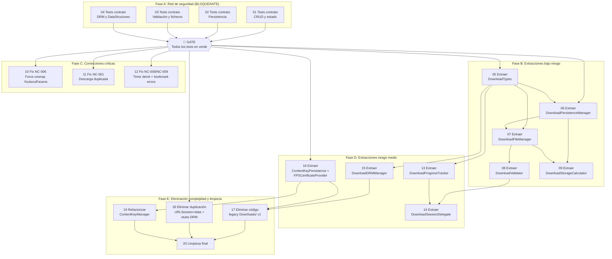

# Plan de Refactorización: iOS Native Downloads (`/ios`)

> Generado a partir de la auditoría del 17/02/2026
> Código fuente: `/Users/danimarin/Development/Repositories/react-native-video/ios`

## Resumen ejecutivo

- **Módulo auditado**: iOS Native — Downloads, DRM, ContentKey, Player features (`/ios`)
- **Tareas totales**: 20 (4 de testing + 16 de refactorización)
- **Estimación total**: 30-45 horas
- **Riesgo general**: Medio-Alto (por la complejidad de `DownloadsModule2.swift` y la ausencia total de tests)

## Principios de la refactorización

1. **Tests primero**: no se toca código de producción sin tests de contrato en verde
2. **Incremental**: cada tarea produce código funcional y compilable
3. **Verificable**: cada tarea tiene criterios de aceptación medibles
4. **Reversible**: cada tarea puede revertirse sin afectar las anteriores

## Supuestos a validar

La auditoría identificó estas preguntas abiertas que pueden afectar al plan:

1. **¿Se usan ambos módulos de descarga (v1 y v2) simultáneamente?** — Afecta a las tareas 17 y 18. Si solo se usa v2, la eliminación de v1 es segura.
2. **¿El `LogManager` con `UITextView` se usa en producción?** — Afecta a la tarea 19.
3. **¿La modificación Axinom en `RCTVideoDRM.swift` es permanente?** — Afecta a la tarea 20 (CI-006).
4. **¿El header `X-AxDRM-Message` vacío en `ContentKeyManager` es intencional?** — Afecta a la tarea 16 (NC-007).

## Mapa de tareas

### Diagrama de dependencias

### Tabla resumen

| # | Tarea | Tipo | Riesgo | Estimación | Depende de | IDs Auditoría | Tests de contrato que la validan |
|---|-------|------|--------|------------|------------|---------------|----------------------------------|
| 01 | Tests contrato — CRUD y estado | test-contrato | bajo | 2h | — | REQ-001..009, REQ-012..015 | — (es ella misma) |
| 02 | Tests contrato — Persistencia | test-contrato | bajo | 2h | — | REQ-016..019 | — (es ella misma) |
| 03 | Tests contrato — Validación y ficheros | test-contrato | bajo | 1.5h | — | REQ-002, REQ-029, CI-004 | — (es ella misma) |
| 04 | Tests contrato — DRM y DataStructures | test-contrato | bajo | 1.5h | — | REQ-020, REQ-025..027, PARSE-001..004 | — (es ella misma) |
| 05 | Extraer DownloadTypes.swift | extracción | bajo | 1h | 01-04 | SA-01, SA-13 | 01, 03 |
| 06 | Extraer DownloadPersistenceManager.swift | extracción | bajo | 2h | 05 | SA-01, SA-07, CI-001 | 02 |
| 07 | Extraer DownloadFileManager.swift | extracción | bajo | 2h | 06 | SA-01, SA-06, CI-004 | 03 |
| 08 | Extraer DownloadValidator.swift | extracción | bajo | 1.5h | 07 | SA-01, REQ-002, REQ-029 | 03 |
| 09 | Extraer DownloadStorageCalculator.swift | extracción | bajo | 1.5h | 06, 07 | SA-01, REQ-032, REQ-033 | 01 |
| 10 | Fix force unwrap YouboraParams | corrección | bajo | 0.5h | 01-04 | NC-006 | 04 |
| 11 | Fix descarga duplicada | corrección | bajo | 1h | 01-04 | NC-001 | 01 |
| 12 | Fix timer deinit + bookmark errors | corrección | bajo | 1h | 01-04 | NC-008, NC-009 | 02 |
| 13 | Extraer DownloadProgressTracker.swift | extracción | medio | 2h | 05 | SA-01, REQ-021, REQ-024 | 01 |
| 14 | Extraer DownloadSessionDelegate.swift | extracción | medio | 2.5h | 08, 13 | SA-01, REQ-021, REQ-022, REQ-029 | 01, 03 |
| 15 | Extraer DownloadDRMManager.swift | extracción | medio | 2h | 05 | SA-01, REQ-028, CI-008 | 04 |
| 16 | Extraer ContentKeyPersistence + FPSCertificateProvider | extracción | medio | 2h | 01-04 | SA-01, REQ-020, REQ-026, NC-011 | 04 |
| 17 | Eliminar código legacy Downloads/ v1 | eliminación | alto | 1.5h | 15, 16 | CI-002, SA-02, NC-005 | 01 |
| 18 | Eliminar duplicación URLSession+data + stubs DRM | eliminación | bajo | 1h | 01-04 | CI-005, CI-008, NC-012 | — |
| 19 | Refactorizar ContentKeyManager.swift | refactorización | alto | 2.5h | 16 | SA-01, SA-03, SA-09, NC-011 | 04 |
| 20 | Limpieza final | limpieza | bajo | 1h | 17, 18, 19 | CI-003, CI-006, CI-007, SA-10, SA-13 | — |

## Fases de ejecución

### ⚠️ Fase A: Red de seguridad (BLOQUEANTE)

**Objetivo**: Capturar el comportamiento actual del código iOS nativo con tests XCTest antes de tocar nada.

**Tareas**: 01, 02, 03, 04

**Fuente de los tests**: El fichero `03-estrategia-testing.md` de la auditoría contiene código XCTest concreto en las secciones 3.1.1 a 3.1.9. Cada task.md de esta fase referencia la sección correspondiente.

**Criterio de fase completada**:
- Todos los tests de contrato ejecutan y pasan en verde
- El comando `xcodebuild test -scheme react-native-video -destination 'platform=iOS Simulator,name=iPhone 15'` sale con código 0
- Se ha validado que los tests cubren todos los REQ-XXX de criticidad alta y crítica

**🚧 GATE**: No proceder a la Fase B hasta que TODOS los tests de contrato estén en verde. Sin excepciones.

**Qué hacer si un test de contrato no pasa contra el código actual**:
- Si el test está mal escrito: corregir el test (el código actual es la verdad).
- Si el código tiene un bug real: documentarlo como NC-XXX en la auditoría y decidir si corregirlo ahora (nueva tarea) o aceptarlo como comportamiento actual.

**Nota importante sobre XCTest**: Al ser código nativo iOS, los tests requieren un target de tests en Xcode. Si no existe, la primera tarea de esta fase debe incluir la creación del target.

---

### Fase B: Extracciones de bajo riesgo

**Objetivo**: Extraer tipos, persistencia, ficheros, validación y cálculo de espacio de `DownloadsModule2.swift` sin cambiar comportamiento.
**Tareas**: 05, 06, 07, 08, 09
**Pre-requisito**: Fase A completada (GATE superado)
**Criterio de fase completada**: `DownloadsModule2.swift` ha perdido ~800-1000 líneas. Cada unidad extraída tiene tests propios. Compila sin errores.

**Validación de regresión**: Al completar cada tarea de esta fase, ejecutar la suite completa de tests de contrato. Deben seguir en verde.

---

### Fase C: Correcciones críticas

**Objetivo**: Corregir los 2 casos no contemplados críticos (NC-001, NC-006) y los de prioridad alta más sencillos (NC-008, NC-009) antes de reestructurar más.
**Tareas**: 10, 11, 12
**Pre-requisito**: Fase A completada (GATE superado). Puede ejecutarse en paralelo con Fase B.
**Criterio de fase completada**: NC-001 y NC-006 resueltos. NC-008 y NC-009 resueltos. Tests de contrato siguen en verde.

**Validación de regresión**: Al completar cada tarea, ejecutar suite completa de tests de contrato.

---

### Fase D: Extracciones de riesgo medio

**Objetivo**: Extraer el delegado de sesión, tracker de progreso, manager DRM y persistencia de claves. Estas extracciones tocan código con efectos secundarios (timers, callbacks de iOS, red).
**Tareas**: 13, 14, 15, 16
**Pre-requisito**: Fase B completada (para tareas 13, 14, 15). Fase A para tarea 16.
**Criterio de fase completada**: `DownloadsModule2.swift` reducido a ~600-800 líneas (orquestador puro). `ContentKeyManager.swift` tiene sus dependencias extraídas.

**Validación de regresión**: Al completar cada tarea, ejecutar suite completa de tests de contrato.

---

### Fase E: Eliminación de complejidad y limpieza

**Objetivo**: Eliminar código legacy, duplicaciones, stubs y hacer la limpieza final.
**Tareas**: 17, 18, 19, 20
**Pre-requisito**: Fases B, C y D completadas.
**Criterio de fase completada**: Código legacy eliminado. `ContentKeyManager` refactorizado. Sin duplicaciones. Valores hardcodeados extraídos a constantes.

**Validación de regresión**: Al completar cada tarea, ejecutar suite completa de tests de contrato.

---

## Orden de ejecución recomendado

Para cada tarea de **Fase A** (tests de contrato):

1. Navega a la carpeta de la tarea
2. Ejecuta `/spec` para detallar qué tests se escriben (basándose en `03-estrategia-testing.md`)
3. Ejecuta `/plan` para planificar la implementación de los tests
4. Ejecuta `/implement` para escribir los tests
5. Ejecuta `/review` para verificar cobertura y que pasan en verde
6. **No ejecutes `/verify`** — no hay baseline de tests que verificar, se están creando

Para cada tarea de **Fase B en adelante** (refactorización):

1. Navega a la carpeta de la tarea
2. Ejecuta `/spec` para generar la especificación técnica
3. Ejecuta `/verify` para validar las asunciones contra el código actual
4. Ejecuta `/plan` para generar el plan de implementación detallado
5. Ejecuta `/implement` para implementar fase por fase
6. **Valida que los tests de contrato siguen en verde** antes de commitear
7. Ejecuta `/review` para validar la implementación

## Gestión de riesgos

### Puntos de no retorno
- Después de la tarea 17 (eliminar legacy v1): si algún código JS usaba `NativeModules.DownloadsModule`, dejará de funcionar. Verificar exhaustivamente antes.
- Después de la tarea 19 (refactorizar ContentKeyManager): la interfaz del singleton cambia internamente. Todas las dependencias deben estar actualizadas.

### Si los tests de contrato fallan durante una refactorización
1. **No commitear**
2. Identificar qué test falla y qué tarea lo causó
3. Opciones:
   - Corregir el código refactorizado para mantener el contrato
   - Si el cambio de contrato es intencional: documentarlo en el task.md como "Cambio de contrato" y actualizar el test con justificación
   - Revertir la tarea si no se encuentra la causa

### Plan de contingencia
- Si la tarea 14 (DownloadSessionDelegate) falla: es la más arriesgada por tocar callbacks de iOS. Revertir y considerar un approach más conservador (extraer solo `finalizeDownload` primero).
- Si la tarea 17 (eliminar legacy) descubre que v1 se usa: convertir en tarea de deprecación gradual en vez de eliminación.
- Si se descubre un problema no previsto: crear nueva tarea, insertarla en la fase apropiada, actualizar dependencias.

## Métricas de éxito

Al completar todas las tareas:

### Testing
- [ ] Todos los tests de contrato originales siguen pasando (o tienen cambios documentados y justificados)
- [ ] Cada nueva unidad extraída tiene tests propios
- [ ] Cobertura de tests cubre todos los REQ-XXX de criticidad alta y crítica
- [ ] Comando de test suite completa sale en verde

### Código
- [ ] Ningún fichero supera 800 líneas
- [ ] No hay dependencias circulares
- [ ] Los code smells SA-01 a SA-17 están resueltos o documentados como aceptados
- [ ] Los casos no contemplados NC-001 y NC-006 (críticos) están resueltos
- [ ] Los NC de prioridad alta están resueltos o tienen tarea asignada
- [ ] La complejidad innecesaria CI-001 a CI-008 de prioridad alta está eliminada

### Trazabilidad

#### IDs de criticidad alta/crítica cubiertos por tests de contrato

| ID | Cubierto por tarea |
|---|---|
| REQ-001 | 01 |
| REQ-002 | 01, 03 |
| REQ-006 | 01 |
| REQ-016 | 02 |
| REQ-017 | 02 |
| REQ-018 | 02 |
| REQ-020 | 04 |
| REQ-021 | 01 |
| REQ-022 | 01 |
| REQ-025 | 04 |
| REQ-026 | 04 |
| REQ-027 | 04 |
| REQ-028 | 04 |
| REQ-029 | 03 |
| REQ-031 | 01 |
| REQ-039 | 04 |

#### IDs de prioridad alta/crítica cubiertos por tareas de refactorización

| ID | Cubierto por tarea |
|---|---|
| NC-001 (Crítica) | 11 |
| NC-006 (Crítica) | 10 |
| NC-005 (Alta) | 17 |
| NC-007 (Alta) | 16, 19 |
| NC-008 (Media) | 12 |
| NC-009 (Alta) | 12 |
| NC-010 (Alta) | 11 (parcial, verificación pre-descarga) |
| NC-011 (Alta) | 16, 19 |
| NC-012 (Alta) | 18 |
| CI-001 (Alta) | 06 |
| CI-002 (Alta) | 17 |
| CI-004 (Alta) | 07 |
| CI-008 (Alta) | 18 |

#### IDs excluidos del plan

| ID | Razón |
|---|---|
| NC-003 (Alta) | Requiere cambio de comportamiento en la capa de red iOS. Se documenta como mejora futura. |
| NC-004 (Baja) | Riesgo real bajo. Se documenta como limitación aceptada. |
| NC-013 (Media) | El umbral del 98% es un compromiso aceptable para HLS. Se documenta. |
| CI-003 (Baja) | LogManager — cambio menor incluido en tarea 20 si se confirma que no se usa en producción. |
| CI-006 (Media) | Modificación Axinom — incluida en tarea 20 como limpieza menor. |
| CI-007 (Baja) | Estimación 500MB — incluida en tarea 20 como limpieza menor. |
