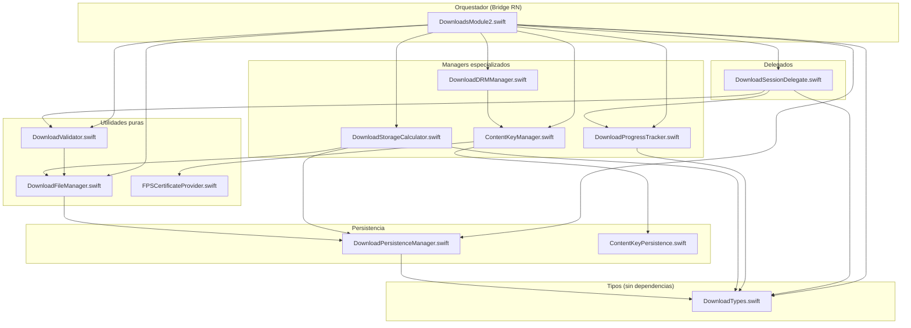

# Fase 2: Propuesta de Segmentación — iOS Native (`/ios`)

Basado en las conclusiones de la Fase 1 (`01-analisis-estructural.md`).

---

## 2.1 Arquitectura propuesta

El foco principal de segmentación es `DownloadsModule2.swift` (2929 líneas, ~15 responsabilidades). Los demás ficheros requieren cambios menores o ninguno.

### Ficheros que NO necesitan segmentación

| Fichero | Justificación |
|---|---|
| `Downloads/Asset.swift` | 114 líneas, responsabilidad única (modelo de datos). Bien estructurado. |
| `Downloads/DownloadsModule.m` | 30 líneas, bridge Obj-C puro. |
| `Downloads_v2/DownloadsModule2.m` | 160 líneas, bridge Obj-C puro. Crece proporcionalmente a los métodos del módulo. |
| `Extensions + Utils/Notification.Name.swift` | 27 líneas, solo constantes. |
| `Extensions + Utils/Utils.swift` | 56 líneas, utilidades puras. Solo necesita eliminar la duplicación con `URLSession+data.swift`. |
| `NowPlayingInfoCenterManager.swift` | 271 líneas, singleton bien acotado con responsabilidad clara. |
| `Video/DataStructures/*` | Structs de datos simples, bien aislados. |
| `Video/Features/RCTVideoErrorHandling.swift` | 115 líneas, enum + factory de errores. |
| `Video/Features/RCTPictureInPicture.swift` | 90 líneas, delegado PiP bien acotado. |
| `Video/Features/RCTVideoSave.swift` | ~30 líneas, funcionalidad mínima. |
| `Video/Features/RCTVideoTVUtils.swift` | ~30 líneas, utilidades tvOS. |
| `Video/Features/URLSession+data.swift` | ~15 líneas. Candidato a eliminación (duplicado con Utils.swift). |
| `Video/RCTVideoPlayerViewController.swift` | 50 líneas, subclase simple. |
| `Video/RCTVideoPlayerViewControllerDelegate.swift` | 8 líneas, protocolo. |
| `Video/RCTVideoSwiftLog/*` | ~25 líneas, bridge de logging. |
| `Video/UIView+FindUIViewController.swift` | 19 líneas, extensión de utilidad. |
| `VideoCaching/*` | 313 líneas total, módulo independiente y bien acotado. |

### Ficheros que necesitan segmentación

---

### A. DownloadsModule2.swift → 9 unidades

#### A1. DownloadTypes.swift

- **Responsabilidad única**: Definición de tipos, enums y constantes del sistema de descargas
- **Tipo**: Tipos/Constantes
- **Interfaz pública**:
  ```swift
  enum DownloadState: String, CaseIterable {
      case idle, queued, preparing, downloading, paused, completed, failed, waitingForNetwork
      var stringValue: String
  }

  struct DownloadInfo {
      var id: String
      var uri: String
      var title: String
      var state: DownloadState
      var progress: Float
      var totalBytes: Int64
      var downloadedBytes: Int64
      var speed: Double
      var remainingTime: Int
      var quality: String?
      var hasSubtitles: Bool
      var hasDRM: Bool
      var error: Error?
      var startTime: Date?
      var assetPath: String?
      var completionTime: Date?
  }

  enum DownloadConstants {
      static let ACTIVE_DOWNLOADS_KEY: String
      static let ASSET_PATHS_KEY: String
      static let ASSET_BOOKMARKS_KEY: String
      static let SUBTITLE_BOOKMARKS_KEY: String
      static let DOWNLOAD_SPACE_CACHE_TTL: TimeInterval
      static let PROGRESS_THRESHOLD: Float  // 0.98
      static let MIN_ASSET_SIZE: Int64      // 1_000_000
      static let DEFAULT_ESTIMATED_SIZE: Int64  // 500_000_000
  }

  enum DownloadQuality {
      case low, medium, high, auto
      var minBitrate: Int
  }
  ```
- **Dependencias de entrada**: Ninguna
- **Eventos/callbacks de salida**: Ninguno

#### A2. DownloadPersistenceManager.swift

- **Responsabilidad única**: Persistencia de estado de descargas, asset paths y bookmarks en UserDefaults
- **Tipo**: Manager (persistencia)
- **Interfaz pública**:
  ```swift
  class DownloadPersistenceManager {
      // Estado de descargas
      func persistDownloadStates(_ downloads: [String: DownloadInfo])
      func restoreDownloadStates() -> [String: DownloadInfo]

      // Asset paths
      func saveAssetPath(_ path: String, forDownloadId id: String)
      func loadAssetPaths() -> [String: String]
      func removeAssetPath(forDownloadId id: String)
      func clearAllAssetPaths()

      // Asset bookmarks (sobreviven cambios de sandbox UUID)
      func saveAssetBookmark(for url: URL, downloadId: String)
      func resolveAssetBookmark(forDownloadId id: String) -> URL?
      func removeAssetBookmark(forDownloadId id: String)

      // Subtitle bookmarks
      func saveSubtitleBookmark(for url: URL, downloadId: String, language: String)
      func resolveSubtitleBookmark(forDownloadId id: String, language: String) -> URL?
      func removeSubtitleBookmark(forDownloadId id: String, language: String)
      func removeAllSubtitleBookmarks(forDownloadId id: String)
  }
  ```
- **Dependencias de entrada**: `DownloadTypes` (para `DownloadInfo`, `DownloadConstants`)
- **Eventos/callbacks de salida**: Ninguno

#### A3. DownloadFileManager.swift

- **Responsabilidad única**: Operaciones de sistema de ficheros: creación de directorios, eliminación de assets, cálculo de tamaños, limpieza de path `/.nofollow`
- **Tipo**: Manager (ficheros)
- **Interfaz pública**:
  ```swift
  class DownloadFileManager {
      func createDirectoriesIfNeeded(downloadDir: String, tempDir: String, subtitlesDir: String) throws
      func removeDownloadedFiles(
          for downloadId: String,
          activeDownloadPath: String?,
          persistenceManager: DownloadPersistenceManager,
          pendingLocation: URL?
      ) -> Bool
      func calculateAssetSize(at url: URL) -> Int64
      func calculateDirectorySize(at url: URL) -> Int64
      func cleanPath(_ path: String) -> String  // Manejo centralizado de /.nofollow
      func fileExists(atPath path: String) -> Bool  // Con fallback /.nofollow
      func purgeOrphanedAssets(
          knownCompletedIds: Set<String>,
          knownAssetPaths: Set<String>,
          downloadDirectory: String,
          session: AVAssetDownloadURLSession?,
          findDownloadId: (AVAggregateAssetDownloadTask) -> String?
      ) -> PurgeResult
  }

  struct PurgeResult {
      let deletedFiles: [String]
      let freedBytes: Int64
      let cancelledTasks: Int
      let cleanedPaths: Int
  }
  ```
- **Dependencias de entrada**: `DownloadPersistenceManager` (para resolución de bookmarks como fallback)
- **Eventos/callbacks de salida**: Ninguno

#### A4. DownloadStorageCalculator.swift

- **Responsabilidad única**: Cálculo de espacio de almacenamiento con cache TTL
- **Tipo**: Utilidad
- **Interfaz pública**:
  ```swift
  class DownloadStorageCalculator {
      func calculateTotalDownloadsSize(
          activeDownloads: [String: DownloadInfo],
          persistenceManager: DownloadPersistenceManager,
          fileManager: DownloadFileManager,
          downloadDirectory: String
      ) -> Int64
      func getSystemInfo(downloadDirectory: String, tempDirectory: String) -> [String: Any]
      func invalidateCache()
  }
  ```
- **Dependencias de entrada**: `DownloadFileManager`, `DownloadPersistenceManager`, `DownloadTypes`
- **Eventos/callbacks de salida**: Ninguno

#### A5. DownloadValidator.swift

- **Responsabilidad única**: Validación de configuración de descarga y de integridad de assets descargados
- **Tipo**: Utilidad pura
- **Interfaz pública**:
  ```swift
  enum DownloadValidator {
      static func validateDownloadConfig(_ config: NSDictionary) -> Bool
      static func validateAssetIntegrity(at location: URL) -> (isValid: Bool, error: String?)
      static func validateAssetIntegrityRelaxed(at location: URL) -> (isValid: Bool, error: String?)
      static func validateDownloadUri(_ uri: String) -> (isValid: Bool, type: String)
  }
  ```
- **Dependencias de entrada**: `DownloadFileManager` (para `calculateAssetSize`, `cleanPath`)
- **Eventos/callbacks de salida**: Ninguno

#### A6. DownloadProgressTracker.swift

- **Responsabilidad única**: Timer de progreso, cálculo de velocidad y tiempo restante, throttling de eventos
- **Tipo**: Manager (progreso)
- **Interfaz pública**:
  ```swift
  protocol DownloadProgressDelegate: AnyObject {
      func progressTracker(_ tracker: DownloadProgressTracker, didUpdateProgress downloadId: String, info: DownloadProgressUpdate)
  }

  struct DownloadProgressUpdate {
      let progress: Float
      let downloadedBytes: Int64
      let totalBytes: Int64
      let speed: Double
      let remainingTime: Int
  }

  class DownloadProgressTracker {
      weak var delegate: DownloadProgressDelegate?

      func startTimerIfNeeded(activeDownloads: [String: DownloadInfo])
      func stopTimerIfNotNeeded(activeDownloads: [String: DownloadInfo])
      func invalidateTimer()

      func updateProgress(
          downloadId: String,
          loadedTimeRanges: [NSValue],
          timeRangeExpectedToLoad: CMTimeRange,
          currentInfo: DownloadInfo
      ) -> DownloadProgressUpdate?

      func shouldEmitProgress(downloadId: String, currentPercent: Int) -> Bool
      func reset(forDownloadId id: String)
  }
  ```
- **Dependencias de entrada**: `DownloadTypes`
- **Eventos/callbacks de salida**: `DownloadProgressDelegate`

#### A7. DownloadSessionDelegate.swift

- **Responsabilidad única**: Implementación de `AVAssetDownloadDelegate` — manejo de callbacks del sistema de descargas iOS
- **Tipo**: Delegado
- **Interfaz pública**:
  ```swift
  protocol DownloadSessionEventHandler: AnyObject {
      func handleDownloadProgress(downloadId: String, update: DownloadProgressUpdate)
      func handleDownloadLocationDetermined(downloadId: String, location: URL)
      func handleMediaSelectionCompleted(downloadId: String, selectionInfo: String)
      func handleDownloadCompleted(downloadId: String)
      func handleDownloadFailed(downloadId: String, error: Error, progress: Float)
      func handleDownloadWaitingForConnectivity(downloadId: String)
  }

  class DownloadSessionDelegate: NSObject, AVAssetDownloadDelegate {
      weak var eventHandler: DownloadSessionEventHandler?
      var progressTracker: DownloadProgressTracker

      // Necesita acceso para buscar downloadId por tarea
      var findDownloadId: ((AVAggregateAssetDownloadTask) -> String?)?
      var getDownloadInfo: ((String) -> DownloadInfo?)?
  }
  ```
- **Dependencias de entrada**: `DownloadProgressTracker`, `DownloadTypes`, `DownloadValidator`
- **Eventos/callbacks de salida**: `DownloadSessionEventHandler`

#### A8. DownloadDRMManager.swift

- **Responsabilidad única**: Configuración de DRM para descargas, gestión de licencias
- **Tipo**: Manager (DRM)
- **Interfaz pública**:
  ```swift
  class DownloadDRMManager {
      func setupDRMForAsset(
          _ asset: AVURLAsset,
          config: NSDictionary,
          contentId: String,
          contentKeySession: AVContentKeySession?
      ) throws

      func downloadLicense(contentId: String, config: NSDictionary) throws
      func checkLicenseValidity(for contentId: String) -> Bool
      func releaseLicense(for downloadId: String)
      func releaseAllLicenses()
  }
  ```
- **Dependencias de entrada**: `ContentKeyManager` (singleton existente)
- **Eventos/callbacks de salida**: Ninguno

#### A9. DownloadsModule2.swift (refactorizado)

- **Responsabilidad única**: Orquestador y bridge RN — coordina los managers, expone métodos a React Native, gestiona estado en memoria
- **Tipo**: Módulo RN (RCTEventEmitter)
- **Interfaz pública**: Misma API pública actual (sin cambios para React Native)
- **Dependencias de entrada**: Todos los managers anteriores (A1-A8), `ContentKeyManager`
- **Eventos/callbacks de salida**: Eventos RN vía `sendEvent(withName:body:)`
- **Estado retenido**: `activeDownloads`, `downloadTasks`, `pendingLocations`, `completedWithoutError`, `downloadsSession`, `contentKeySession`, `downloadQueue`
- **Líneas estimadas**: ~600-800 (vs 2929 actuales)

---

### B. ContentKeyManager.swift → 3 unidades

#### B1. FPSCertificateProvider.swift

- **Responsabilidad única**: Obtención y validación de certificados FairPlay Streaming
- **Tipo**: Utilidad
- **Interfaz pública**:
  ```swift
  class FPSCertificateProvider {
      func requestApplicationCertificate(from url: String) async throws -> Data
      func validateCertificate(_ data: Data) -> Bool
  }
  ```
- **Dependencias de entrada**: Ninguna (usa URLSession directamente)
- **Eventos/callbacks de salida**: Ninguno

#### B2. ContentKeyPersistence.swift

- **Responsabilidad única**: Persistencia de claves de contenido en disco (escritura, lectura, eliminación)
- **Tipo**: Manager (persistencia)
- **Interfaz pública**:
  ```swift
  class ContentKeyPersistence {
      var contentKeyDirectory: URL { get }

      func writePersistableContentKey(data: Data, assetName: String, contentKeyId: String) throws
      func readPersistableContentKey(assetName: String, contentKeyId: String) -> Data?
      func deletePersistableContentKey(assetName: String, contentKeyId: String)
      func deleteAllPersistableContentKeys(forAssetName name: String, contentKeyIds: [String])
      func persistableContentKeyExists(assetName: String, contentKeyId: String) -> Bool
  }
  ```
- **Dependencias de entrada**: Ninguna
- **Eventos/callbacks de salida**: Ninguno

#### B3. ContentKeyManager.swift (refactorizado)

- **Responsabilidad única**: Delegado de `AVContentKeySession` — orquesta solicitudes de clave online y offline
- **Tipo**: Manager (DRM)
- **Interfaz pública**: Misma interfaz actual del singleton
- **Dependencias de entrada**: `FPSCertificateProvider`, `ContentKeyPersistence`
- **Eventos/callbacks de salida**: `NotificationCenter` (HasAvailablePersistableContentKey)
- **Líneas estimadas**: ~350-400 (vs 772 actuales)

---

### C. AssetDownloader.swift → Sin segmentación, pero con limpieza

- **Justificación**: Si `DownloadsModule` (v1) se elimina, `AssetDownloader.swift` se convierte en código muerto. Si se mantiene, sus 411 líneas son aceptables para una sola responsabilidad.
- **Acción recomendada**: Eliminar junto con `Downloads/` si se confirma que v1 no se usa.

---

### D. LogManager.swift → Simplificación

- **Acción recomendada**: Eliminar la dependencia de `UITextView`. Convertir a un logger puro que solo escriba a consola. Si se necesita logging visual, inyectar el textView como dependencia opcional.
- **No requiere segmentación**: 104 líneas es aceptable.

---

### E. Video/Features/RCTVideoUtils.swift → Sin segmentación

- **Justificación**: 499 líneas pero son funciones estáticas puras agrupadas en un enum. Cada función es independiente. La estructura actual es correcta para una colección de utilidades.

---

### F. Video/RCTVideo.swift → Fuera de alcance

- **Justificación**: ~73KB es un God Object evidente, pero su refactorización es un proyecto independiente que afecta al player completo, no solo a descargas. Se documenta como hallazgo pero no se propone segmentación en esta auditoría.

---

## 2.2 Diagrama de dependencias



### Verificación del diagrama

- **No hay dependencias circulares**: El flujo es estrictamente unidireccional (tipos → utilidades → managers → orquestador)
- **Módulos puros no importan módulos con efectos**: `DownloadTypes`, `DownloadValidator` son puros. `DownloadFileManager` usa `FileManager` (efecto) pero es inevitable para su responsabilidad.
- **Tipos compartidos en fichero separado**: `DownloadTypes.swift` es importado por todos los demás sin crear acoplamiento.

---

## 2.3 Plan de migración

Ordenado de menor a mayor riesgo. Cada paso es independiente salvo donde se indica.

---

#### Paso 1: Extraer DownloadTypes.swift

- **Riesgo**: bajo
- **Qué se extrae**: Enum `DownloadState`, struct `DownloadInfo`, constantes de UserDefaults keys, enum `DownloadQuality` (nuevo, extraído de switch en `createDownloadTask`)
- **Origen**: `DownloadsModule2.swift`, líneas 1-100 aprox. (enum `DownloadState`, struct `DownloadInfo`, constantes)
- **Destino**: `ios/Downloads_v2/DownloadTypes.swift`
- **Interfaz**: Ver sección A1 arriba
- **Cambios en el original**: Eliminar las definiciones de `DownloadState`, `DownloadInfo` y constantes. Añadir `import` del nuevo fichero (implícito en Swift si están en el mismo target).
- **Validación**: Compilar el proyecto. Los tipos son usados en todo el fichero, así que un error de compilación indicaría inmediatamente si algo falta.
- **Dependencias con otros pasos**: Ninguna. Este es el paso fundacional.

---

#### Paso 2: Extraer DownloadPersistenceManager.swift

- **Riesgo**: bajo
- **Qué se extrae**: Toda la lógica de persistencia en UserDefaults (estado de descargas, asset paths, asset bookmarks, subtitle bookmarks)
- **Origen**: `DownloadsModule2.swift`, funciones `persistDownloadState()`, `restoreDownloadStates()`, `saveAssetPath()`, `loadAssetPaths()`, `removeAssetPath()`, `clearAllAssetPaths()`, `saveAssetBookmark()`, `loadAssetBookmarks()`, `resolveAssetBookmark()`, `removeAssetBookmark()`, `saveSubtitleBookmark()`, `loadSubtitleBookmarks()`, `resolveSubtitleBookmark()`, `removeSubtitleBookmark()`, `removeAllSubtitleBookmarks()` — líneas ~2622-2896
- **Destino**: `ios/Downloads_v2/DownloadPersistenceManager.swift`
- **Interfaz**: Ver sección A2 arriba
- **Cambios en el original**: Reemplazar todas las llamadas directas a UserDefaults por llamadas a `persistenceManager.xxx()`. Añadir propiedad `private let persistenceManager = DownloadPersistenceManager()`.
- **Validación**: Compilar. Ejecutar una descarga completa y verificar que el estado persiste tras restart de la app. Verificar que los bookmarks se resuelven correctamente tras recompilación (cambio de sandbox UUID).
- **Dependencias con otros pasos**: Paso 1 (necesita `DownloadInfo`, `DownloadConstants`)

---

#### Paso 3: Extraer DownloadFileManager.swift

- **Riesgo**: bajo
- **Qué se extrae**: Operaciones de FileManager: creación de directorios, eliminación de ficheros descargados, cálculo de tamaño de assets, manejo centralizado de `/.nofollow`
- **Origen**: `DownloadsModule2.swift`, funciones `createDirectoriesIfNeeded()` (líneas 1252-1263), `removeDownloadedFiles()` (líneas 1597-1704), `calculateAssetSize()` (líneas 2427-2489), `calculateDirectorySize()` (líneas 2593-2615)
- **Destino**: `ios/Downloads_v2/DownloadFileManager.swift`
- **Interfaz**: Ver sección A3 arriba. Incluye `cleanPath()` centralizado que reemplaza las ~10 ocurrencias dispersas de manejo de `/.nofollow`.
- **Cambios en el original**: Reemplazar llamadas directas a `FileManager` por `fileManager.xxx()`. Eliminar código inline de `/.nofollow` y usar `fileManager.cleanPath()`.
- **Validación**: Compilar. Ejecutar eliminación de una descarga y verificar que los ficheros se borran correctamente. Verificar que `calculateAssetSize` devuelve valores correctos.
- **Dependencias con otros pasos**: Paso 2 (usa `DownloadPersistenceManager` para resolución de bookmarks como fallback en `removeDownloadedFiles`)

---

#### Paso 4: Extraer DownloadValidator.swift

- **Riesgo**: bajo
- **Qué se extrae**: Validación de configuración de descarga y de integridad de assets
- **Origen**: `DownloadsModule2.swift`, funciones `validateDownloadConfig()` (línea 1365), `validateAssetIntegrity()` (líneas 2337-2382), `validateAssetIntegrityRelaxed()` (líneas 2387-2421), `validateDownloadUri()` (líneas 1100-1108)
- **Destino**: `ios/Downloads_v2/DownloadValidator.swift`
- **Interfaz**: Ver sección A5 arriba
- **Cambios en el original**: Reemplazar llamadas por `DownloadValidator.validateXxx()`.
- **Validación**: Compilar. Verificar que una descarga completada pasa la validación de integridad. Verificar que un asset corrupto (directorio vacío) falla la validación.
- **Dependencias con otros pasos**: Paso 3 (usa `DownloadFileManager.calculateAssetSize` y `cleanPath`)

---

#### Paso 5: Extraer DownloadStorageCalculator.swift

- **Riesgo**: bajo
- **Qué se extrae**: Cálculo de espacio total de descargas con cache TTL, info del sistema
- **Origen**: `DownloadsModule2.swift`, funciones `calculateTotalDownloadsSize()` (líneas 2491-2590), `getSystemInfoDict()` (líneas 1900-1956), `invalidateDownloadSpaceCache()` (línea 2618), propiedades `cachedDownloadSpace`, `downloadSpaceCacheTime`
- **Destino**: `ios/Downloads_v2/DownloadStorageCalculator.swift`
- **Interfaz**: Ver sección A4 arriba
- **Cambios en el original**: Reemplazar por `storageCalculator.calculateTotalDownloadsSize(...)` y `storageCalculator.getSystemInfo(...)`. Eliminar propiedades de cache del módulo.
- **Validación**: Compilar. Llamar a `getSystemInfo` desde JS y verificar que devuelve valores coherentes de espacio.
- **Dependencias con otros pasos**: Pasos 2 y 3

---

#### Paso 6: Extraer DownloadProgressTracker.swift

- **Riesgo**: medio
- **Qué se extrae**: Timer de progreso, cálculo de velocidad/tiempo restante, throttling de eventos (1% increments)
- **Origen**: `DownloadsModule2.swift`, funciones `startProgressTimerIfNeeded()` (líneas 1283-1308), `stopProgressTimerIfNotNeeded()` (líneas 1311-1321), `invalidateProgressTimer()` (líneas 1324-1332), `checkProgressUpdates()` (líneas 1335-1348), cálculo de progreso dentro de `urlSession(didLoad:...)` (líneas 1994-2065), propiedades `progressTimer`, `lastProgressUpdate`, `lastReportedProgress`
- **Destino**: `ios/Downloads_v2/DownloadProgressTracker.swift`
- **Interfaz**: Ver sección A6 arriba
- **Cambios en el original**: Eliminar timer y propiedades de progreso. Crear instancia de `DownloadProgressTracker` e implementar `DownloadProgressDelegate`.
- **Validación**: Compilar. Iniciar una descarga y verificar que los eventos de progreso se emiten correctamente con incrementos de 1%. Verificar que el timer se detiene cuando no hay descargas activas.
- **Dependencias con otros pasos**: Paso 1

---

#### Paso 7: Extraer DownloadSessionDelegate.swift

- **Riesgo**: medio
- **Qué se extrae**: Implementación de `AVAssetDownloadDelegate` — todos los callbacks de URLSession
- **Origen**: `DownloadsModule2.swift`, extensión `AVAssetDownloadDelegate` (líneas 1975-2258), `finalizeDownload()` (líneas 2260-2332), métodos legacy de delegado (líneas 2110-2123)
- **Destino**: `ios/Downloads_v2/DownloadSessionDelegate.swift`
- **Interfaz**: Ver sección A7 arriba
- **Cambios en el original**: Eliminar la extensión `AVAssetDownloadDelegate` y `finalizeDownload()`. Crear instancia de `DownloadSessionDelegate`, asignarla como delegate de la sesión, e implementar `DownloadSessionEventHandler` en `DownloadsModule2`.
- **Validación**: Compilar. Ejecutar ciclo completo de descarga (inicio → progreso → completado). Verificar manejo de errores (cancelar descarga, simular error de red). Verificar recovery tras restart.
- **Dependencias con otros pasos**: Pasos 4, 6

---

#### Paso 8: Extraer DownloadDRMManager.swift

- **Riesgo**: medio
- **Qué se extrae**: Configuración de DRM para descargas, gestión de licencias
- **Origen**: `DownloadsModule2.swift`, funciones `setupDRMForAsset()` (líneas 1563-1595), `downloadLicense()` (líneas 927-942), `checkLicense()` (líneas 944-958), `renewLicense()` (línea 961), `releaseLicense()` (líneas 966-969), `releaseAllLicenses()` (líneas 971-974), `downloadLicenseForContent()` (línea 1869), `checkLicenseValidity()` (línea 1873), `releaseLicenseForDownload()` (línea 1865)
- **Destino**: `ios/Downloads_v2/DownloadDRMManager.swift`
- **Interfaz**: Ver sección A8 arriba
- **Cambios en el original**: Reemplazar por `drmManager.setupDRMForAsset(...)`, etc.
- **Validación**: Compilar. Descargar contenido con DRM FairPlay y verificar que la licencia se obtiene correctamente. Verificar playback offline del contenido descargado.
- **Dependencias con otros pasos**: Paso 1. Independiente de los demás.

---

#### Paso 9: Extraer ContentKeyPersistence.swift

- **Riesgo**: medio
- **Qué se extrae**: Persistencia de claves FairPlay en disco
- **Origen**: `ContentKeyManager.swift`, funciones `writePersistableContentKey()`, `deletePeristableContentKey()`, `deleteAllPeristableContentKeys()`, propiedad `contentKeyDirectory` — líneas ~600-716
- **Destino**: `ios/Managers/ContentKeyPersistence.swift`
- **Interfaz**: Ver sección B2 arriba
- **Cambios en el original**: Reemplazar por `keyPersistence.writePersistableContentKey(...)`, etc. Añadir propiedad `let keyPersistence = ContentKeyPersistence()`.
- **Validación**: Compilar. Descargar contenido DRM, verificar que las claves se persisten en disco. Eliminar descarga y verificar que las claves se eliminan.
- **Dependencias con otros pasos**: Ninguna directa. Puede hacerse en paralelo con pasos 1-8.

---

#### Paso 10: Extraer FPSCertificateProvider.swift

- **Riesgo**: medio
- **Qué se extrae**: Obtención de certificados FairPlay desde URL
- **Origen**: `ContentKeyManager.swift`, función `requestApplicationCertificate()` — líneas ~650-706
- **Destino**: `ios/Managers/FPSCertificateProvider.swift`
- **Interfaz**: Ver sección B1 arriba. Convertir de síncrono a async/await para eliminar el `URLSession.synchronousDataTask()`.
- **Cambios en el original**: Reemplazar por `certificateProvider.requestApplicationCertificate(from:)`. Eliminar uso de `URLSession.synchronousDataTask()` en este contexto.
- **Validación**: Compilar. Reproducir contenido DRM y verificar que el certificado se obtiene correctamente. Verificar manejo de error cuando la URL del certificado es inválida.
- **Dependencias con otros pasos**: Ninguna directa.

---

#### Paso 11: Refactorizar ContentKeyManager.swift

- **Riesgo**: alto
- **Qué se extrae**: No se extrae nada nuevo — se refactoriza para usar `FPSCertificateProvider` y `ContentKeyPersistence`
- **Origen**: `ContentKeyManager.swift` completo (772 líneas)
- **Destino**: Mismo fichero, refactorizado (~350-400 líneas)
- **Interfaz**: Misma interfaz pública del singleton
- **Cambios en el original**: Inyectar `FPSCertificateProvider` y `ContentKeyPersistence`. Eliminar código movido a esos ficheros. Considerar convertir `requestContentKeyFromKeySecurityModule()` a async.
- **Validación**: Test completo de DRM: reproducción online con FairPlay, descarga con DRM, playback offline. Verificar que las claves se persisten y eliminan correctamente.
- **Dependencias con otros pasos**: Pasos 9 y 10

---

#### Paso 12: Eliminar código legacy (Downloads/ + AssetDownloader)

- **Riesgo**: alto (requiere confirmación de que v1 no se usa)
- **Qué se extrae**: Eliminación completa de `Downloads/Asset.swift`, `Downloads/DownloadsModule.swift`, `Downloads/DownloadsModule.m`, `Managers/AssetDownloader.swift`
- **Origen**: Directorio `Downloads/` completo + `Managers/AssetDownloader.swift`
- **Destino**: Eliminación
- **Interfaz**: N/A
- **Cambios en el original**: Verificar que ningún código JS referencia `DownloadsModule` (v1). Eliminar ficheros. Eliminar `Asset.swift` si `DownloadsModule2` no lo necesita (actualmente solo lo usa para `setupDRMForAsset`, que podría crear el Asset internamente en `DownloadDRMManager`).
- **Validación**: Compilar. Buscar en el código TypeScript/JS referencias a `NativeModules.DownloadsModule` (sin el "2"). Ejecutar suite completa de descargas.
- **Dependencias con otros pasos**: Todos los anteriores completados. Requiere confirmación explícita del usuario.

---

#### Paso 13: Eliminar duplicación URLSession+data

- **Riesgo**: bajo
- **Qué se extrae**: Eliminación de `Video/Features/URLSession+data.swift` (duplicado de `Extensions + Utils/Utils.swift`)
- **Origen**: `Video/Features/URLSession+data.swift`
- **Destino**: Eliminación. Mantener la versión en `Utils.swift`.
- **Cambios en el original**: Verificar que los ficheros que importan la extensión siguen compilando (en Swift, las extensiones son globales dentro del target).
- **Validación**: Compilar.
- **Dependencias con otros pasos**: Ninguna.

---

### Resumen del plan

| Paso | Descripción | Riesgo | Prerequisitos |
|---|---|---|---|
| 1 | Extraer `DownloadTypes.swift` | Bajo | — |
| 2 | Extraer `DownloadPersistenceManager.swift` | Bajo | 1 |
| 3 | Extraer `DownloadFileManager.swift` | Bajo | 2 |
| 4 | Extraer `DownloadValidator.swift` | Bajo | 3 |
| 5 | Extraer `DownloadStorageCalculator.swift` | Bajo | 2, 3 |
| 6 | Extraer `DownloadProgressTracker.swift` | Medio | 1 |
| 7 | Extraer `DownloadSessionDelegate.swift` | Medio | 4, 6 |
| 8 | Extraer `DownloadDRMManager.swift` | Medio | 1 |
| 9 | Extraer `ContentKeyPersistence.swift` | Medio | — |
| 10 | Extraer `FPSCertificateProvider.swift` | Medio | — |
| 11 | Refactorizar `ContentKeyManager.swift` | Alto | 9, 10 |
| 12 | Eliminar código legacy (Downloads/ v1) | Alto | Todos, confirmación usuario |
| 13 | Eliminar duplicación URLSession+data | Bajo | — |

**Resultado esperado**: `DownloadsModule2.swift` pasa de 2929 líneas a ~600-800. `ContentKeyManager.swift` pasa de 772 a ~350-400. Se eliminan ~900 líneas de código legacy. Total de ficheros nuevos: 8. Total de ficheros eliminados: 5 (si se confirma eliminación de v1).
