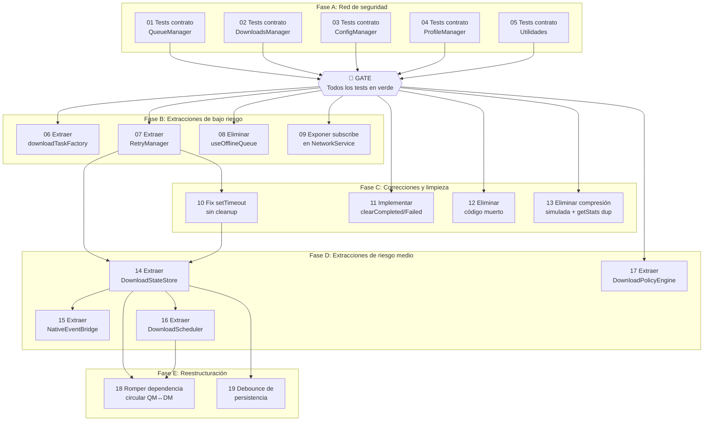

# Plan de Refactorización: Offline Downloads

> Generado a partir de la auditoría del 2025-02-17
> Código fuente: `src/player/features/offline/`

## Resumen ejecutivo

- **Módulo auditado**: `src/player/features/offline/` — sistema de descargas offline (managers, services, hooks, utils)
- **Tareas totales**: 19 (5 de testing + 14 de refactorización)
- **Estimación total**: 25–35 horas
- **Riesgo general**: Medio (la dependencia circular QueueManager ↔ DownloadsManager es el punto más delicado)

## Principios de la refactorización

1. **Tests primero**: no se toca código de producción sin tests de contrato en verde
2. **Incremental**: cada tarea produce código funcional y deployable
3. **Verificable**: cada tarea tiene criterios de aceptación medibles
4. **Reversible**: cada tarea puede revertirse sin afectar las anteriores

## Mapa de tareas

### Diagrama de dependencias

### Tabla resumen

| # | Tarea | Tipo | Riesgo | Estimación | Depende de | IDs Auditoría | Tests de contrato que la validan |
|---|-------|------|--------|------------|------------|---------------|----------------------------------|
| 01 | Tests contrato QueueManager | test-contrato | bajo | 2–3h | — | REQ-001, REQ-002, REQ-003, REQ-006, REQ-007, REQ-008, REQ-009, REQ-010, REQ-018, REQ-026 | — (es ella misma) |
| 02 | Tests contrato DownloadsManager | test-contrato | bajo | 2–3h | — | REQ-001, REQ-002, REQ-003, REQ-004, REQ-005, REQ-006, REQ-011 | — (es ella misma) |
| 03 | Tests contrato ConfigManager | test-contrato | bajo | 1h | — | REQ-015 | — (es ella misma) |
| 04 | Tests contrato ProfileManager | test-contrato | bajo | 1h | — | REQ-014 | — (es ella misma) |
| 05 | Tests contrato Utilidades | test-contrato | bajo | 1–2h | — | REQ-019, REQ-020, REQ-021, REQ-022 | — (es ella misma) |
| 06 | Extraer downloadTaskFactory | extracción | bajo | 1–2h | 01, 02 | SA-02 | QueueManager, DownloadsManager |
| 07 | Extraer RetryManager | extracción | bajo | 1–2h | 01 | SA-03 | QueueManager |
| 08 | Eliminar useOfflineQueue | eliminación | bajo | 0.5h | 01 | CI-005, SA-06 | QueueManager |
| 09 | Exponer subscribe en NetworkService | corrección | bajo | 0.5h | 01 | SA-05 | QueueManager |
| 10 | Fix setTimeout sin cleanup en reintentos | corrección | bajo | 1h | 07 | NC-002 | QueueManager |
| 11 | Implementar clearCompleted/clearFailed | corrección | bajo | 0.5h | 02 | NC-012 | DownloadsManager |
| 12 | Eliminar código muerto en DownloadsManager | eliminación | bajo | 0.5h | 02 | CI-003, CI-004 | DownloadsManager |
| 13 | Eliminar compresión simulada + getStats duplicado | eliminación | bajo | 1h | 01, 05 | CI-001, CI-002 | QueueManager, Utilidades |
| 14 | Extraer DownloadStateStore | extracción | medio | 2–3h | 07, 10 | SA-03 | QueueManager |
| 15 | Extraer NativeEventBridge | extracción | medio | 2h | 14 | SA-03 | QueueManager |
| 16 | Extraer DownloadScheduler | extracción | medio | 2h | 14 | SA-03 | QueueManager |
| 17 | Extraer DownloadPolicyEngine | extracción | medio | 1–2h | 02 | SA-04 | DownloadsManager |
| 18 | Romper dependencia circular QM↔DM | reestructuración | alto | 2–3h | 14, 16 | SA-01, NC-006 | QueueManager, DownloadsManager |
| 19 | Debounce de persistencia | corrección | medio | 1–2h | 14 | NC-003, SA-10 | QueueManager |

## Fases de ejecución

### ⚠️ Fase A: Red de seguridad (BLOQUEANTE)

**Objetivo**: Capturar el comportamiento actual del código con tests de contrato antes de tocar nada.

**Tareas**: 01, 02, 03, 04, 05

**Fuente de los tests**: El fichero `03-estrategia-testing.md` de la auditoría contiene código de test concreto para estas tareas. Cada task.md de esta fase referencia la sección correspondiente.

**Criterio de fase completada**: 
- Todos los tests de contrato ejecutan y pasan en verde
- El comando `npx jest --testPathPattern="__tests__/offline"` sale con código 0
- Se ha validado que los tests cubren todos los REQ-XXX de criticidad alta y crítica

**🚧 GATE**: No proceder a la Fase B hasta que TODOS los tests de contrato estén en verde. Sin excepciones.

**Qué hacer si un test de contrato no pasa contra el código actual**:
- Si el test está mal escrito: corregir el test (el código actual es la verdad).
- Si el código tiene un bug real: documentarlo como NC-XXX en la auditoría y decidir si corregirlo ahora (nueva tarea) o aceptarlo como comportamiento actual.

---

### Fase B: Extracciones de bajo riesgo

**Objetivo**: Extraer funcionalidad a unidades independientes sin cambiar comportamiento. Eliminar redundancias evidentes.

**Tareas**: 06, 07, 08, 09

**Pre-requisito**: Fase A completada (GATE superado)

**Criterio de fase completada**: 
- `downloadTaskFactory` existe y ambos hooks lo usan (sin código duplicado)
- `RetryManager` existe como clase independiente con tests propios
- `useOfflineQueue` eliminado, sin imports rotos
- `useNetworkStatus` no usa casting forzado

**Validación de regresión**: Al completar cada tarea de esta fase, ejecutar `npx jest --testPathPattern="__tests__/offline"`. Deben seguir en verde.

---

### Fase C: Correcciones y limpieza

**Objetivo**: Corregir bugs silenciosos y eliminar código muerto antes de las extracciones grandes.

**Tareas**: 10, 11, 12, 13

**Pre-requisito**: Fase B completada (tareas 07 y 10 tienen dependencia directa)

**Criterio de fase completada**:
- Todos los `setTimeout` de reintentos tienen tracking y cancelación en `destroy()`
- `clearCompleted()` y `clearFailed()` funcionan realmente
- `handleDownloadEvent`, `notifyQueueManagerOfEvent`, `handleAutoRetry`, `enforceGlobalLimits` eliminados
- Compresión simulada eliminada de PersistenceService
- Solo existe un método `getQueueStats()` en QueueManager

**Validación de regresión**: `npx jest --testPathPattern="__tests__/offline"` en verde tras cada tarea.

---

### Fase D: Extracciones de riesgo medio

**Objetivo**: Descomponer QueueManager (2645 líneas) y DownloadsManager (1630 líneas) en unidades cohesionadas.

**Tareas**: 14, 15, 16, 17

**Pre-requisito**: Fases B y C completadas

**Criterio de fase completada**:
- QueueManager reducido a <800 líneas (orquestación pura)
- DownloadsManager reducido a <1000 líneas
- `DownloadStateStore`, `NativeEventBridge`, `DownloadScheduler`, `DownloadPolicyEngine` existen con tests propios
- Cada nueva unidad tiene interfaz pública tipada

**Validación de regresión**: `npx jest --testPathPattern="__tests__/offline"` en verde tras cada tarea.

---

### Fase E: Reestructuración

**Objetivo**: Resolver los problemas arquitectónicos de fondo: dependencia circular y persistencia excesiva.

**Tareas**: 18, 19

**Pre-requisito**: Fase D completada

**Criterio de fase completada**:
- No existe import circular entre QueueManager y DownloadsManager
- La persistencia usa debounce (máximo 1 escritura cada 2 segundos)
- `grep -r "from.*DownloadsManager" managers/QueueManager.ts` no devuelve resultados

**Validación de regresión**: `npx jest --testPathPattern="__tests__/offline"` en verde tras cada tarea.

---

## Orden de ejecución recomendado

Para cada tarea de **Fase A** (tests de contrato):

1. Navega a la carpeta de la tarea
2. Ejecuta `/spec` para detallar qué tests se escriben (basándose en `03-estrategia-testing.md`)
3. Ejecuta `/plan` para planificar la implementación de los tests
4. Ejecuta `/implement` para escribir los tests
5. Ejecuta `/review` para verificar cobertura y que pasan en verde
6. **No ejecutes `/verify`** — no hay baseline de tests que verificar, se están creando

Para cada tarea de **Fase B en adelante** (refactorización):

1. Navega a la carpeta de la tarea
2. Ejecuta `/spec` para generar la especificación técnica
3. Ejecuta `/verify` para validar las asunciones contra el código actual
4. Ejecuta `/plan` para generar el plan de implementación detallado
5. Ejecuta `/implement` para implementar fase por fase
6. **Valida que los tests de contrato siguen en verde** antes de commitear
7. Ejecuta `/review` para validar la implementación

## Gestión de riesgos

### Puntos de no retorno
- Después de la tarea 18 (romper dependencia circular): revertir requiere restaurar el import circular y la función `sendToDestinationQueue`, lo cual es posible pero tedioso.

### Si los tests de contrato fallan durante una refactorización
1. **No commitear**
2. Identificar qué test falla y qué tarea lo causó
3. Opciones:
   - Corregir el código refactorizado para mantener el contrato
   - Si el cambio de contrato es intencional: documentarlo en el task.md como "Cambio de contrato" y actualizar el test con justificación
   - Revertir la tarea si no se encuentra la causa

### Plan de contingencia
- Si la tarea 14 (DownloadStateStore) falla: revertir y mantener el estado inline en QueueManager. Las tareas 15, 16, 18, 19 se bloquean pero el resto del plan sigue válido.
- Si la tarea 18 (dependencia circular) falla: revertir. El sistema funciona con la dependencia circular; es un code smell, no un bug.
- Si se descubre un problema no previsto: crear nueva tarea con prefijo "XX-hotfix-" y priorizar según impacto.

### Supuestos a validar
- La auditoría asume que no existen tests previos para el módulo offline. Verificar con `find src/player/features/offline -name "*.test.ts" -o -name "*.spec.ts"` antes de empezar.
- Los mocks propuestos en `03-estrategia-testing.md` asumen las interfaces actuales de los singletons. Si alguna interfaz ha cambiado desde la auditoría, los mocks necesitarán ajustes.

## Métricas de éxito

Al completar todas las tareas:

### Testing
- [ ] Todos los tests de contrato originales siguen pasando (o tienen cambios documentados y justificados)
- [ ] Cada nueva unidad extraída tiene tests propios
- [ ] Cobertura de tests cubre todos los REQ-XXX de criticidad alta y crítica
- [ ] Comando `npx jest --testPathPattern="__tests__/offline"` sale en verde

### Código
- [ ] Ningún fichero supera 1000 líneas
- [ ] No hay dependencias circulares entre managers
- [ ] Los 15 code smells (SA-01 a SA-15) identificados en la auditoría están resueltos
- [ ] Los casos no contemplados (NC-002, NC-003, NC-006, NC-012) prioritarios están gestionados
- [ ] La complejidad innecesaria (CI-001 a CI-005) prioritaria está eliminada

### Trazabilidad

| ID Auditoría | Prioridad | Cubierto por tarea(s) |
|---|---|---|
| REQ-001 | crítica | 01, 02, 06 |
| REQ-002 | crítica | 01, 02 |
| REQ-003 | alta | 01, 02 |
| REQ-004 | alta | 02 |
| REQ-005 | alta | 02 |
| REQ-006 | alta | 01, 02 |
| REQ-007 | alta | 01, 16 |
| REQ-008 | alta | 01, 07, 10 |
| REQ-009 | alta | 01, 07 |
| REQ-010 | crítica | 01, 19 |
| REQ-011 | alta | 02 |
| REQ-012 | alta | 02 |
| REQ-014 | alta | 04 |
| REQ-015 | media | 03 |
| REQ-018 | media | 01, 13 |
| REQ-019 | baja | 05 |
| REQ-020 | baja | 05 |
| REQ-021 | baja | 05 |
| REQ-022 | media | 05 |
| REQ-023 | alta | 01, 15 |
| REQ-025 | alta | — (requiere tests E2E nativos, fuera de alcance) |
| REQ-026 | baja | 01 |
| SA-01 | alta | 18 |
| SA-02 | alta | 06 |
| SA-03 | alta | 07, 14, 15, 16 |
| SA-04 | alta | 17 |
| SA-05 | media | 09 |
| SA-06 | media | 08 |
| SA-10 | alta | 19 |
| NC-002 | alta | 10 |
| NC-003 | alta | 19 |
| NC-006 | alta | 18 |
| NC-012 | alta | 11 |
| CI-001 | alta | 13 |
| CI-002 | alta | 13 |
| CI-003 | alta | 12 |
| CI-004 | alta | 12 |
| CI-005 | alta | 08 |

**IDs excluidos del plan**:
- **REQ-013, REQ-016, REQ-017, REQ-024, REQ-027, REQ-028**: prioridad media/baja, no requieren refactorización estructural. Se beneficiarán indirectamente de la mejora de testabilidad.
- **REQ-025 (DRM)**: requiere tests E2E con módulos nativos reales. Fuera del alcance de esta refactorización de código TypeScript.
- **NC-001, NC-004, NC-005, NC-007 a NC-011**: prioridad media/baja. Se pueden abordar en iteraciones futuras una vez la arquitectura esté limpia.
- **CI-006 a CI-010**: prioridad baja. Mejoras opcionales que no bloquean la refactorización.
