# Fase 2: Propuesta de segmentación

## 2.1 Arquitectura propuesta

---

### QueueManager.ts → 5 unidades

El fichero actual (2645 líneas) combina demasiadas responsabilidades. Se propone extraer las siguientes unidades:

---

#### Unidad 1: `DownloadScheduler`
- **Ubicación:** `managers/queue/DownloadScheduler.ts`
- **Responsabilidad única:** Decidir cuándo y qué descarga iniciar según concurrencia, red y prioridad.
- **Tipo:** Service
- **Interfaz pública:**
```typescript
export class DownloadScheduler {
  constructor(config: SchedulerConfig, deps: SchedulerDependencies);
  start(): void;
  stop(): void;
  isRunning(): boolean;
  forceProcessNow(): void;
  setMaxConcurrent(count: number): void;
  canDownloadNow(): boolean;
}

export interface SchedulerConfig {
  maxConcurrentDownloads: number;
  processIntervalMs: number;
  staggerDelayMs: number;
}

export interface SchedulerDependencies {
  getQueuedItems: () => DownloadItem[];
  getActiveCount: () => number;
  sendToDestination: (item: DownloadItem) => Promise<void>;
  isNetworkAvailable: () => boolean;
  isWifiRequired: () => boolean;
  isWifiConnected: () => boolean;
  logger: Logger;
}
```
- **Dependencias de entrada:** Funciones inyectadas (no singletons directos)
- **Eventos/callbacks de salida:** `onDownloadStarted(downloadId)`, `onSchedulerStopped()`, `onConcurrencyLimitReached()`

---

#### Unidad 2: `RetryManager`
- **Ubicación:** `managers/queue/RetryManager.ts`
- **Responsabilidad única:** Gestionar reintentos con backoff exponencial y clasificación de errores.
- **Tipo:** Service
- **Interfaz pública:**
```typescript
export class RetryManager {
  constructor(config: RetryConfig, logger: Logger);
  shouldRetry(downloadId: string, error: unknown): boolean;
  scheduleRetry(downloadId: string, onRetry: () => void): void;
  getRetryCount(downloadId: string): number;
  clearRetries(downloadId: string): void;
  clearAll(): void;
  isNonRetryableError(error: unknown): boolean;
}

export interface RetryConfig {
  maxRetries: number;
  retryDelayMs: number;
  maxDelayMs: number;
}
```
- **Dependencias de entrada:** Config, Logger
- **Eventos/callbacks de salida:** `onRetryScheduled(downloadId, attempt, delayMs)`, `onRetryExhausted(downloadId)`

---

#### Unidad 3: `NativeEventBridge`
- **Ubicación:** `managers/queue/NativeEventBridge.ts`
- **Responsabilidad única:** Traducir eventos nativos y de BinaryDownloadService al formato interno del QueueManager.
- **Tipo:** Service
- **Interfaz pública:**
```typescript
export class NativeEventBridge {
  constructor(deps: EventBridgeDependencies, logger: Logger);
  setup(): void;
  teardown(): void;
}

export interface EventBridgeDependencies {
  nativeManager: NativeManager;
  binaryDownloadService: BinaryDownloadService;
  onProgress: (downloadId: string, percent: number, bytesDownloaded: number, totalBytes: number, speed: number) => void;
  onCompleted: (downloadId: string, fileUri?: string, fileSize?: number) => void;
  onFailed: (downloadId: string, error: unknown) => void;
  onStateChanged: (downloadId: string, state: string) => void;
}
```
- **Dependencias de entrada:** `NativeManager`, `BinaryDownloadService` (inyectados)
- **Eventos/callbacks de salida:** Callbacks tipados en `EventBridgeDependencies`

---

#### Unidad 4: `DownloadStateStore`
- **Ubicación:** `managers/queue/DownloadStateStore.ts`
- **Responsabilidad única:** CRUD del Map de descargas con persistencia y locks.
- **Tipo:** Service
- **Interfaz pública:**
```typescript
export class DownloadStateStore {
  constructor(persistenceService: PersistenceService, logger: Logger);
  async loadFromPersistence(): Promise<void>;
  async add(item: DownloadItem): Promise<void>;
  async remove(downloadId: string): Promise<void>;
  async updateState(downloadId: string, state: DownloadStates, fileUri?: string, fileSize?: number): Promise<void>;
  async updateProgress(downloadId: string, progress: number, bytesWritten?: number, totalBytes?: number): Promise<void>;
  get(downloadId: string): DownloadItem | null;
  getAll(): DownloadItem[];
  getByState(states: DownloadStates[]): DownloadItem[];
  getByType(type: DownloadType): DownloadItem[];
  has(downloadId: string): boolean;
  get size(): number;
  async reorder(newOrder: string[]): Promise<void>;
  async clear(): Promise<void>;
  async clearByState(states: DownloadStates[]): Promise<void>;
  acquireLock(downloadId: string, operation: "removing" | "updating"): boolean;
  releaseLock(downloadId: string): void;
  isLocked(downloadId: string): boolean;
  deepClone(item: DownloadItem): DownloadItem;
}
```
- **Dependencias de entrada:** `PersistenceService` (inyectado)
- **Eventos/callbacks de salida:** Ninguno (store puro)

---

#### Unidad 5: `QueueManager` (reducido)
- **Ubicación:** `managers/QueueManager.ts` (mismo fichero, reducido)
- **Responsabilidad única:** Orquestación de alto nivel: coordina Store, Scheduler, RetryManager y EventBridge.
- **Tipo:** Manager
- **Interfaz pública:** Mantiene la misma interfaz pública actual, pero delega internamente.
- **Dependencias de entrada:** `DownloadStateStore`, `DownloadScheduler`, `RetryManager`, `NativeEventBridge`
- **Eventos/callbacks de salida:** Mismos eventos actuales via `EventEmitter`

---

### DownloadsManager.ts → 2 unidades

---

#### Unidad 6: `DownloadPolicyEngine`
- **Ubicación:** `managers/policies/DownloadPolicyEngine.ts`
- **Responsabilidad única:** Evaluar y aplicar políticas globales (red, espacio, concurrencia, perfiles).
- **Tipo:** Service
- **Interfaz pública:**
```typescript
export class DownloadPolicyEngine {
  constructor(deps: PolicyDependencies, logger: Logger);
  async validateBeforeDownload(task: BinaryDownloadTask | StreamDownloadTask, type: DownloadType): Promise<void>;
  applyNetworkPolicy(isConnected: boolean, isWifi: boolean): PolicyAction;
  applyStoragePolicy(isLowSpace: boolean, isCritical: boolean): PolicyAction;
  applyConfigChange(property: string, newValue: unknown): PolicyAction;
  shouldAutoRetry(retryCount: number, maxRetries: number): boolean;
}

export type PolicyAction = 'pause_all' | 'resume_all' | 'restart_queue' | 'none';

export interface PolicyDependencies {
  networkService: NetworkService;
  storageService: StorageService;
  configManager: ConfigManager;
  profileManager: ProfileManager;
}
```
- **Dependencias de entrada:** Servicios inyectados
- **Eventos/callbacks de salida:** Retorna `PolicyAction` que el caller ejecuta

---

#### Unidad 7: `DownloadsManager` (reducido)
- **Ubicación:** `managers/DownloadsManager.ts` (mismo fichero, reducido)
- **Responsabilidad única:** API pública para hooks y coordinación de inicialización.
- **Tipo:** Manager
- **Interfaz pública:** Mantiene la misma interfaz pública actual.
- **Dependencias de entrada:** `QueueManager`, `DownloadPolicyEngine`, `DownloadService`, `NativeManager`
- **Eventos/callbacks de salida:** Mismos eventos actuales

---

### Hooks: Extracción de lógica compartida

---

#### Unidad 8: `downloadTaskFactory`
- **Ubicación:** `utils/downloadTaskFactory.ts`
- **Responsabilidad única:** Crear `BinaryDownloadTask` o `StreamDownloadTask` a partir de parámetros de entrada, incluyendo extracción de subtítulos de manifiestos.
- **Tipo:** Utilidad pura
- **Interfaz pública:**
```typescript
export async function createDownloadTask(params: {
  id: string;
  title: string;
  uri: string;
  type: DownloadType;
  manifestContent?: string;
  drm?: IDrm;
  drmScheme?: string;
  profileId?: string;
  subtitles?: SubtitleTrack[];
}): Promise<{
  task: BinaryDownloadTask | StreamDownloadTask;
  extractedSubtitles: SubtitleTrack[];
}>;

export function extractSubtitlesFromManifest(
  manifestContent: string,
  manifestUrl: string,
  type: 'HLS' | 'DASH'
): SubtitleTrack[];

export function sortDownloads(downloads: DownloadItem[]): DownloadItem[];
```
- **Dependencias de entrada:** `DASHManifestParser`, `HLSManifestParser` (inyectados o importados)
- **Eventos/callbacks de salida:** Ninguno (función pura)

---

### Ficheros que NO necesitan segmentación

| Fichero | Justificación |
|---|---|
| `managers/ConfigManager.ts` (624 líneas) | Responsabilidad única clara. Tamaño razonable. Bien cohesionado. |
| `managers/ProfileManager.ts` (321 líneas) | Responsabilidad única clara. Compacto y bien enfocado. |
| `managers/NativeManager.ts` (1343 líneas) | Aunque es grande, es un wrapper 1:1 del módulo nativo. Segmentarlo añadiría indirección sin valor. |
| `services/download/DownloadService.ts` (~616 líneas) | Patrón Strategy limpio. Delegación clara. |
| `services/download/BinaryDownloadService.ts` (~1079 líneas) | Responsabilidad cohesionada. La complejidad es inherente al dominio. |
| `services/download/StreamDownloadService.ts` (~1084 líneas) | Responsabilidad cohesionada. La complejidad es inherente al dominio. |
| `services/download/SubtitleDownloadService.ts` (~785 líneas) | Responsabilidad única. Tamaño razonable. |
| `services/network/NetworkService.ts` (554 líneas) | Bien estructurado. Responsabilidad única. |
| `services/storage/PersistenceService.ts` (1121 líneas) | Aunque grande, toda la lógica es de persistencia. La compresión simulada debería eliminarse (ver CI-01 en Fase 4). |
| `services/storage/StorageService.ts` (1430 líneas) | Wrapper cohesionado de RNFS. Podría segmentarse pero el beneficio es bajo. |
| `services/manifest/DASHManifestParser.ts` (~387 líneas) | Parser puro. Solo necesita extraer la lógica de "3cat". |
| `services/manifest/HLSManifestParser.ts` (~317 líneas) | Parser puro. Bien estructurado. |
| Todos los hooks excepto `useDownloadsManager`/`useDownloadsList` | Responsabilidad única, tamaño razonable. |
| Todos los ficheros de `types/`, `utils/`, `constants.ts`, `defaultConfigs.ts` | Bien organizados. |

---

## 2.2 Diagrama de dependencias

```mermaid
graph TD
    subgraph "Capa de Hooks (React)"
        H_DM[useDownloadsManager]
        H_DL[useDownloadsList]
        H_DP[useDownloadsProgress]
        H_DQ[useDownloadsQueue]
        H_DC[useDownloadsConfig]
        H_DS[useDownloadsStatus]
        H_PR[useDownloadsProfile]
        H_NS[useNetworkStatus]
        H_SI[useStorageInfo]
    end

    subgraph "Capa de Orquestación"
        DM[DownloadsManager<br/>reducido]
        QM[QueueManager<br/>reducido]
        PE[DownloadPolicyEngine<br/>NUEVO]
    end

    subgraph "Capa de Queue Internals"
        DSS[DownloadStateStore<br/>NUEVO]
        DS_sched[DownloadScheduler<br/>NUEVO]
        RM[RetryManager<br/>NUEVO]
        NEB[NativeEventBridge<br/>NUEVO]
    end

    subgraph "Capa de Servicios"
        DServ[DownloadService]
        BDS[BinaryDownloadService]
        SDS[StreamDownloadService]
        SubDS[SubtitleDownloadService]
        NS[NetworkService]
        SS[StorageService]
        PS[PersistenceService]
        NM[NativeManager]
    end

    subgraph "Capa de Managers Auxiliares"
        CM[ConfigManager]
        PM[ProfileManager]
    end

    subgraph "Utilidades"
        DTF[downloadTaskFactory<br/>NUEVO]
        FMT[formatters]
        DU[downloadsUtils]
        SC[SpeedCalculator]
        EM[ErrorMapper]
    end

    subgraph "Parsers"
        DASH[DASHManifestParser]
        HLS[HLSManifestParser]
    end

    %% Hooks → Orquestación
    H_DM --> DM
    H_DM --> QM
    H_DM --> DTF
    H_DL --> DM
    H_DL --> QM
    H_DL --> DTF
    H_DP --> QM
    H_DQ --> QM
    H_DC --> CM
    H_DS --> DM
    H_PR --> PM
    H_NS --> NS
    H_SI --> SS

    %% Orquestación → Queue Internals
    QM --> DSS
    QM --> DS_sched
    QM --> RM
    QM --> NEB

    %% Orquestación → Servicios
    DM --> QM
    DM --> PE
    DM --> DServ
    DM --> NM
    PE --> NS
    PE --> SS
    PE --> CM
    PE --> PM

    %% Queue Internals → Servicios
    DSS --> PS
    NEB --> NM
    NEB --> BDS
    DS_sched -.->|callback| DM

    %% Servicios → Servicios
    DServ --> BDS
    DServ --> SDS
    SDS --> SubDS
    SDS --> NM

    %% Utilidades
    DTF --> DASH
    DTF --> HLS
    QM --> SC
```



**Verificaciones del diagrama:**
- ✅ No hay dependencias circulares (la flecha `DS_sched → DM` es un callback inyectado, no un import)
- ✅ Flujo de datos predominantemente unidireccional (Hooks → Managers → Services)
- ✅ Módulos puros (`DTF`, `formatters`, `downloadsUtils`, `SC`, `EM`) no importan módulos con efectos secundarios
- ✅ Tipos/interfaces están en `types/` separados y compartidos

---

## 2.3 Plan de migración

---

#### Paso 1: Extraer `downloadTaskFactory`
- **Riesgo:** bajo
- **Qué se extrae:** Lógica de creación de tasks y extracción de subtítulos de manifiestos, actualmente duplicada en `useDownloadsManager` y `useDownloadsList`.
- **Origen:** `hooks/useDownloadsManager.ts` función `addDownload` (líneas ~350-500), `hooks/useDownloadsList.ts` función `addDownload` (líneas ~150-300). También `sortDownloads` duplicada en ambos.
- **Destino:** `utils/downloadTaskFactory.ts`
- **Interfaz:**
```typescript
export async function createDownloadTask(params: CreateDownloadTaskParams): Promise<CreateDownloadTaskResult>;
export function extractSubtitlesFromManifest(content: string, url: string, type: 'HLS' | 'DASH'): SubtitleTrack[];
export function sortDownloads(downloads: DownloadItem[]): DownloadItem[];
```
- **Cambios en el original:** Ambos hooks reemplazan la lógica inline de `addDownload` por llamadas a `createDownloadTask()`. Se elimina `sortDownloads` duplicada y se importa desde la utilidad.
- **Validación:** Verificar que `addDownload` en ambos hooks produce el mismo `DownloadItem` que antes. Test manual: añadir una descarga DASH con subtítulos, una HLS con subtítulos, y una binaria.
- **Dependencias con otros pasos:** Ninguna. Es el paso más seguro y de mayor impacto.

---

#### Paso 2: Extraer `RetryManager`
- **Riesgo:** bajo
- **Qué se extrae:** Lógica de reintentos con backoff exponencial y clasificación de errores no reintentables.
- **Origen:** `managers/QueueManager.ts` funciones `handleDownloadFailure()` (líneas 1655-1734), `isNonRetryableError()` (líneas 1739-1790), y estado `retryTracker` (línea 47).
- **Destino:** `managers/queue/RetryManager.ts`
- **Interfaz:**
```typescript
export class RetryManager {
  shouldRetry(downloadId: string, error: unknown): boolean;
  scheduleRetry(downloadId: string, onRetry: () => void): void;
  getRetryCount(downloadId: string): number;
  clearRetries(downloadId: string): void;
  clearAll(): void;
  destroy(): void;
}
```
- **Cambios en el original:** `QueueManager.handleDownloadFailure()` delega a `this.retryManager.shouldRetry()` y `this.retryManager.scheduleRetry()`. Se elimina `retryTracker`, `isNonRetryableError()` y la lógica de setTimeout.
- **Validación:** Test unitario del `RetryManager` aislado: verificar backoff exponencial, clasificación de errores, límite de reintentos. Verificar que descargas fallidas siguen reintentándose correctamente.
- **Dependencias con otros pasos:** Ninguna.

---

#### Paso 3: Extraer `DownloadStateStore`
- **Riesgo:** medio
- **Qué se extrae:** CRUD del Map de descargas, persistencia, locks, deep clone.
- **Origen:** `managers/QueueManager.ts` — `downloadQueue` (línea 39), `updateDownloadState()` (líneas 1839-1905), `updateDownloadProgress()` (líneas 1912-1951), `acquireLock()`/`releaseLock()` (líneas 1798-1832), `deepCloneItem()`, `loadPersistedQueue()`, `clearByState()` (líneas 953-1028), `reorderQueue()` (líneas 800-837), `clearQueue()` (líneas 757-793).
- **Destino:** `managers/queue/DownloadStateStore.ts`
- **Interfaz:**
```typescript
export class DownloadStateStore {
  async loadFromPersistence(): Promise<void>;
  async add(item: DownloadItem): Promise<void>;
  async remove(downloadId: string): Promise<void>;
  async updateState(downloadId: string, state: DownloadStates, fileUri?: string, fileSize?: number): Promise<void>;
  async updateProgress(downloadId: string, progress: number, bytesWritten?: number, totalBytes?: number): Promise<void>;
  get(downloadId: string): DownloadItem | null;
  getAll(): DownloadItem[];
  getByState(states: DownloadStates[]): DownloadItem[];
  has(downloadId: string): boolean;
  get size(): number;
  async reorder(newOrder: string[]): Promise<void>;
  async clear(): Promise<void>;
  async clearByState(states: DownloadStates[]): Promise<void>;
  acquireLock(downloadId: string, op: "removing" | "updating"): boolean;
  releaseLock(downloadId: string): void;
}
```
- **Cambios en el original:** `QueueManager` reemplaza accesos directos a `this.downloadQueue` por llamadas a `this.store.*`. Se eliminan ~400 líneas del QueueManager.
- **Validación:** Test unitario del Store con mock de PersistenceService. Verificar que add/remove/update persisten correctamente. Verificar locks. Test de integración: flujo completo de descarga.
- **Dependencias con otros pasos:** Ninguna, pero facilita los pasos 4 y 5.

---

#### Paso 4: Extraer `NativeEventBridge`
- **Riesgo:** medio
- **Qué se extrae:** Setup de event listeners nativos y de BinaryDownloadService, traducción de formatos de eventos.
- **Origen:** `managers/QueueManager.ts` — `setupNativeEventListeners()` (líneas 82-117), `setupBinaryEventListeners()` (líneas 123-179), `handleNativeProgressEvent()`, `handleNativeStateEvent()`, `handleNativeCompletedEvent()`, `handleNativeErrorEvent()` (líneas ~2050-2400 aprox.).
- **Destino:** `managers/queue/NativeEventBridge.ts`
- **Interfaz:**
```typescript
export class NativeEventBridge {
  constructor(deps: EventBridgeDependencies, logger: Logger);
  setup(): void;
  teardown(): void;
}
```
- **Cambios en el original:** `QueueManager.initialize()` crea un `NativeEventBridge` con callbacks que llaman a métodos del QueueManager (store updates, event emission). Se eliminan ~300 líneas de handlers de eventos.
- **Validación:** Test unitario del Bridge con mocks de NativeManager y BinaryDownloadService. Verificar que los callbacks se invocan con los datos correctos. Test de integración: verificar que progreso y completado siguen funcionando.
- **Dependencias con otros pasos:** Paso 3 (DownloadStateStore) facilita los callbacks.

---

#### Paso 5: Extraer `DownloadScheduler`
- **Riesgo:** medio
- **Qué se extrae:** Lógica de procesamiento de cola, scheduling con interval, verificación de concurrencia, stagger delay.
- **Origen:** `managers/QueueManager.ts` — `start()` (línea 1101), `startProcessing()` (líneas 1117-1133), `stopProcessing()` (líneas 1140-1147), `processQueue()` (líneas 1155-1168), `doProcessQueue()` (líneas 1175-1338), `canDownloadNow()` (líneas 1346-1357).
- **Destino:** `managers/queue/DownloadScheduler.ts`
- **Interfaz:**
```typescript
export class DownloadScheduler {
  constructor(config: SchedulerConfig, deps: SchedulerDependencies);
  start(): void;
  stop(): void;
  isRunning(): boolean;
  forceProcessNow(): void;
  setMaxConcurrent(count: number): void;
  destroy(): void;
}
```
- **Cambios en el original:** `QueueManager.start()` delega a `this.scheduler.start()`. Se eliminan ~200 líneas de lógica de scheduling.
- **Validación:** Test unitario del Scheduler con dependencias mockeadas. Verificar: respeta maxConcurrent, stagger delay, para cuando no hay trabajo, reinicia tras completar. Test de integración: flujo completo con múltiples descargas concurrentes.
- **Dependencias con otros pasos:** Paso 3 (DownloadStateStore) para `getQueuedItems` y `getActiveCount`.

---

#### Paso 6: Extraer `DownloadPolicyEngine`
- **Riesgo:** medio
- **Qué se extrae:** Evaluación de políticas globales (red, espacio, configuración) y decisión de acciones.
- **Origen:** `managers/DownloadsManager.ts` — `setupGlobalPolicies()` (líneas 307-341), `handleNetworkEvent()` (líneas 607-647), `handleStorageEvent()` (líneas 654-674), `handleConfigEvent()` (líneas 365-427), `applyGlobalPolicies()` (líneas 681-691), `validateGlobalPolicies()` (líneas 1533-1560).
- **Destino:** `managers/policies/DownloadPolicyEngine.ts`
- **Interfaz:**
```typescript
export class DownloadPolicyEngine {
  async validateBeforeDownload(task: BinaryDownloadTask | StreamDownloadTask, type: DownloadType): Promise<void>;
  applyNetworkPolicy(isConnected: boolean, isWifi: boolean): PolicyAction;
  applyStoragePolicy(isLowSpace: boolean, isCritical: boolean): PolicyAction;
  applyConfigChange(property: string, newValue: unknown): PolicyAction;
}
```
- **Cambios en el original:** `DownloadsManager` reemplaza lógica inline de políticas por llamadas a `this.policyEngine.*` y ejecuta la `PolicyAction` retornada.
- **Validación:** Test unitario del PolicyEngine: verificar cada combinación de estado de red/espacio/config produce la acción correcta. Test de integración: cambiar WiFi-only mientras hay descargas activas.
- **Dependencias con otros pasos:** Ninguna directa, pero se beneficia de que QueueManager ya esté simplificado.

---

#### Paso 7: Romper dependencia circular QueueManager ↔ DownloadsManager
- **Riesgo:** alto
- **Qué se extrae:** La llamada `downloadsManager.startDownloadNow()` desde `QueueManager.sendToDestinationQueue()`.
- **Origen:** `managers/QueueManager.ts` línea 1418
- **Destino:** Inyección de callback en `DownloadScheduler`
- **Interfaz:** El `DownloadScheduler` recibe `sendToDestination: (item: DownloadItem) => Promise<void>` como dependencia inyectada. `DownloadsManager` proporciona esta función durante la inicialización.
- **Cambios en el original:**
  1. `QueueManager` elimina el import de `downloadsManager` (línea 17).
  2. `QueueManager.initialize()` acepta un callback `startDownload` que el `DownloadsManager` proporciona.
  3. `DownloadsManager.initializeSystemServices()` pasa `this.startDownloadNow.bind(this)` al QueueManager.
- **Validación:** Verificar que el import circular ya no existe (`grep -r "from.*DownloadsManager" managers/QueueManager.ts`). Test de integración: flujo completo de descarga.
- **Dependencias con otros pasos:** Pasos 3 y 5 (DownloadStateStore y DownloadScheduler).

---

#### Paso 8: Eliminar hook redundante `useOfflineQueue`
- **Riesgo:** bajo
- **Qué se extrae:** Se elimina el fichero completo.
- **Origen:** `hooks/useOfflineQueue.ts` (134 líneas)
- **Destino:** Eliminación. Consumidores migran a `useDownloadsQueue`.
- **Cambios en el original:** Eliminar `useOfflineQueue.ts`. Actualizar `hooks/index.ts` para no exportarlo. Buscar y reemplazar imports en consumidores.
- **Validación:** `grep -r "useOfflineQueue" src/` no debe devolver resultados (excepto en docs). Verificar que la app compila.
- **Dependencias con otros pasos:** Ninguna.

---

#### Paso 9: Exponer método `subscribe` público en NetworkService
- **Riesgo:** bajo
- **Qué se extrae:** Se añade un método público que evite el casting forzado en `useNetworkStatus`.
- **Origen:** `hooks/useNetworkStatus.ts` líneas 13-18, 87 (casting a `NetworkServiceWithEventEmitter`)
- **Destino:** `services/network/NetworkService.ts` — añadir método `onEvent(event, callback)` público.
- **Cambios en el original:** `useNetworkStatus` reemplaza el casting por `networkService.onEvent(...)`.
- **Validación:** Verificar que `useNetworkStatus` funciona sin el casting. Buscar otros castings similares.
- **Dependencias con otros pasos:** Ninguna.

---

### Resumen del plan

| Paso | Unidad | Riesgo | Líneas afectadas | Prerequisitos |
|---|---|---|---|---|
| 1 | `downloadTaskFactory` | Bajo | ~300 (hooks) | — |
| 2 | `RetryManager` | Bajo | ~150 (QueueManager) | — |
| 3 | `DownloadStateStore` | Medio | ~400 (QueueManager) | — |
| 4 | `NativeEventBridge` | Medio | ~300 (QueueManager) | Paso 3 |
| 5 | `DownloadScheduler` | Medio | ~200 (QueueManager) | Paso 3 |
| 6 | `DownloadPolicyEngine` | Medio | ~200 (DownloadsManager) | — |
| 7 | Romper dependencia circular | Alto | ~50 | Pasos 3, 5 |
| 8 | Eliminar `useOfflineQueue` | Bajo | ~134 | — |
| 9 | Exponer `subscribe` en NetworkService | Bajo | ~20 | — |
